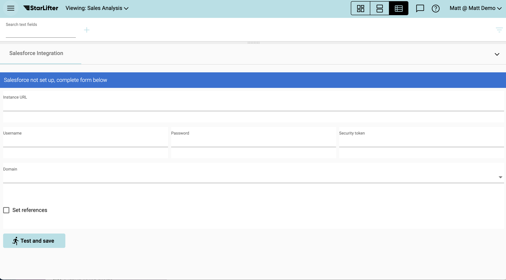

## Integrate with Salesforce
Creating StarLifter collections from your Salesforce data only take a few minutes.

Before you begin, contact your Salesforce Administrator for the following information:
* Instance URL
* User license
* User password
* Security Token

Note: The User license must be a Salesforce API user with Salesforce user with ModifyAllData or ModifyMetadata permissions.

### Set up API Integration
1. From the menu at the upper left of the screen, select Toggle menu

</img>

2. Select Salesforce Integration under the Additional Links dropdown

</img>

3. Enter the information provided by your Salesforce Administrator

</img>

### Upload data
