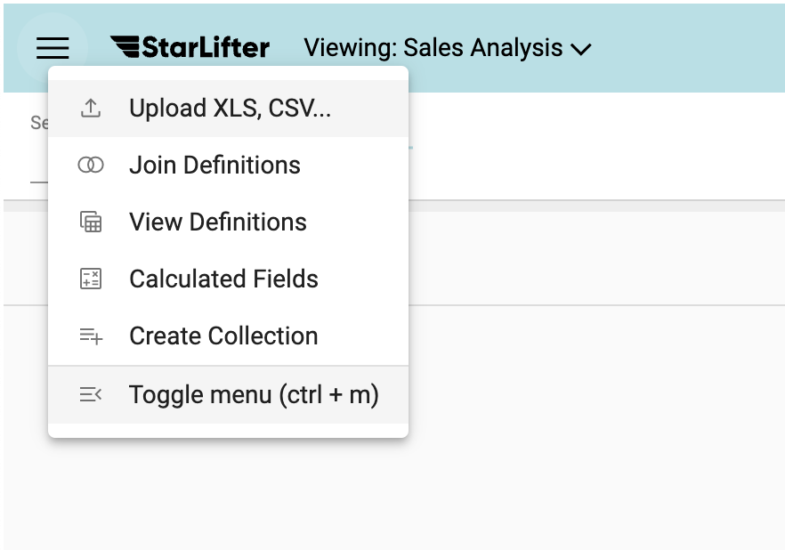
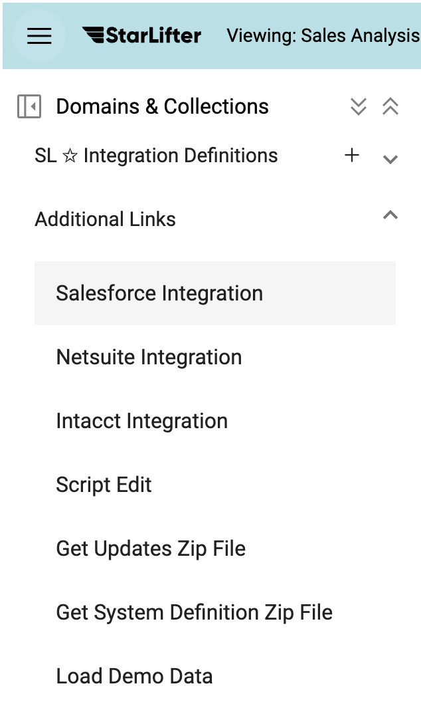
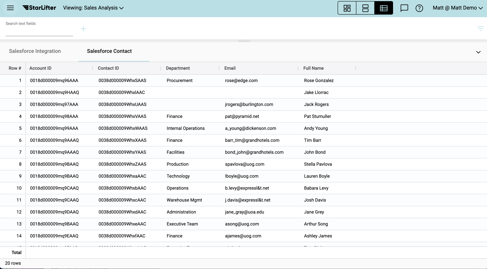

## Integrate with Salesforce
Creating StarLifter collections from your Salesforce data only takes a few minutes.

Before you begin, contact your Salesforce Administrator for the following information:
* Instance URL
* User login
* User password
* Security Token

**Note:** The user login must be a Salesforce API license with ModifyAllData or ModifyMetadata permissions

### Set up API Integration
1. From the menu at the upper left of the screen, select **Toggle menu**

</img>

2. Select **Salesforce Integration** under the Additional Links dropdown

</img>

3. Enter the information provided by your Salesforce Administrator

</img>

### Upload data
1. Select the Objects and Fields you wish to download

</img>
   
2. Check **Preview only** and select **Go** to preview the collection

</img>

3. When you are ready to download the collection, uncheck **Preview**. You have several options available to you when you download a collection
   * **Drop current collection first:** If a StarLifter collection already exists, drop the current collection and replace it with the new collection. Alternatively, StarLifter will update the current collection
   * **Copy all rows:** Download all records in a Salesforce object, rather than specifying the number of records to pull
   * **Set references:** Automatically set StarLifter references for Salesforce reference fields

</img>
  
4. Push **Go** to download the StarLifter collection. Once downloaded, the data is available as a new StarLifter collection

</img>

