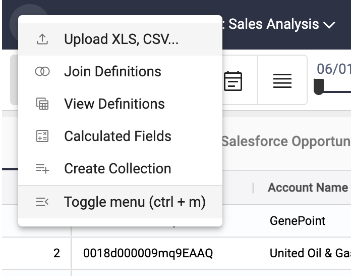
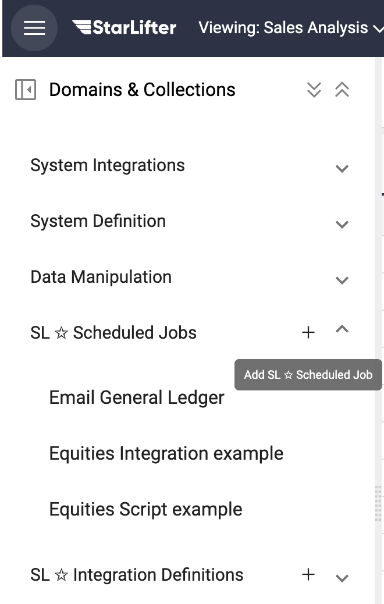
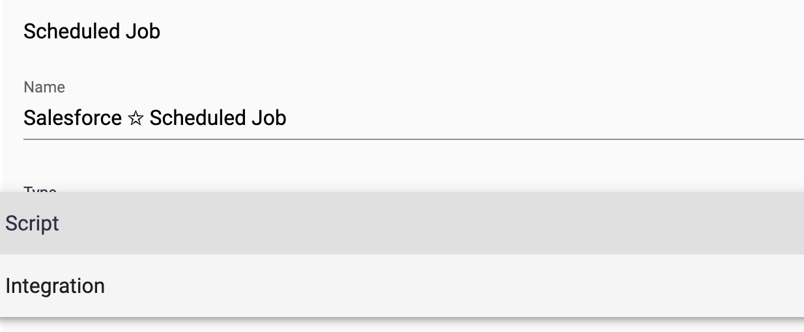
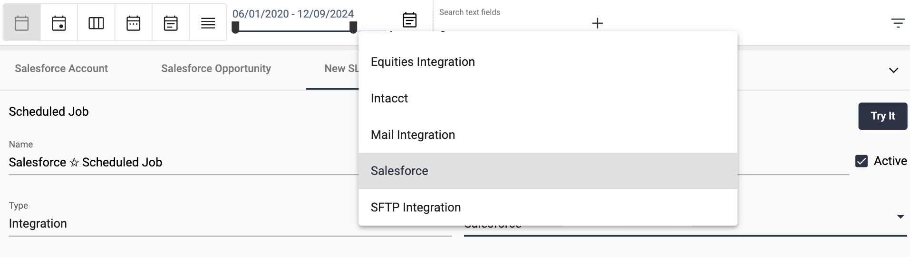
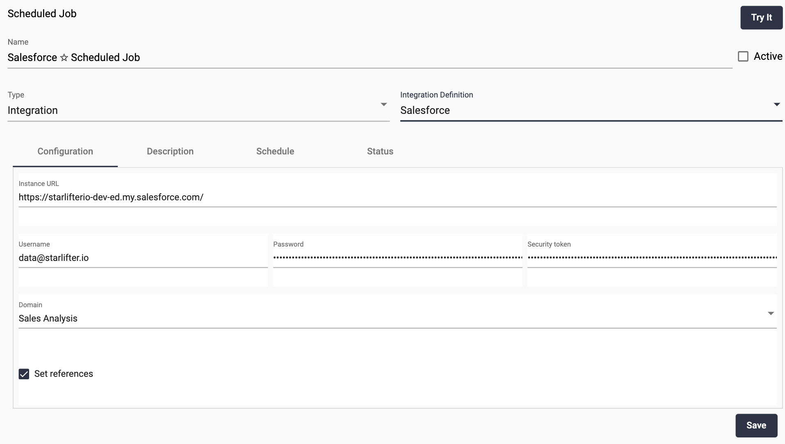
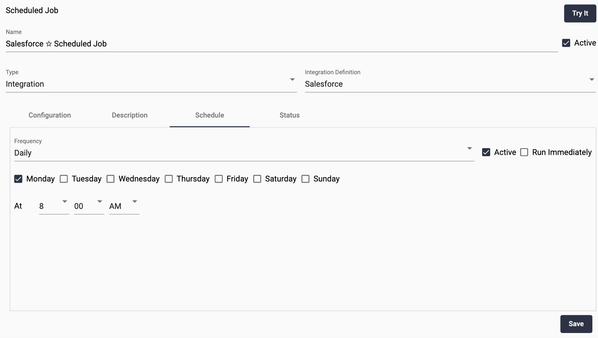

## Scheduled Integrations

[Video Tutorial](https://youtu.be/ejp6YxLDN4s?feature=shared)

Use a Scheduled Job to schedule your integrations so data is automatically pulled into StarLifter.

### Create a Scheduled Job
1. From the menu at the upper left of the screen, select **Toggle menu**.

</img>

2. Select the **+** next to **SL ☆ Scheduled Jobs**.

</img>

3. Name the Scheduled Job. Under **Type** select, Integration.

</img>

4. Select the **Integration Definition**.

</img>

5. If you have already configured the integration, the information will populate. Click **Save**.

</img>

7. Select the **Frequency** of the integration, and the details about when you wish the data to be pulled. Check **Active**.

</img>

9. To run the integration immediately, select **Try It**. To save the Scheduled Job, click **Save**.
