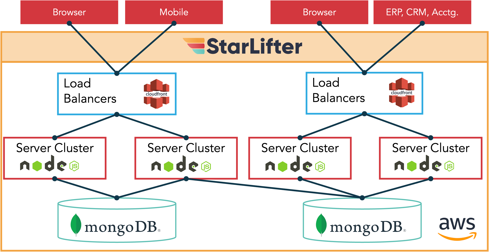

## StarLifter Architecture and Security

### Data security is our top priority

#### Hosted in AWS
* Affording credentialed server security – Federal Risk and Authorization Management Program (FedRAMP) and Federal Information Security Management Act (FISMA) 
* Data fully encrypted at rest

#### Application architecture 
* 1:1 customer to database – Data completely separate by organization 
* Built-in, single sign on (SSO) authentication 
* Data access controls – Org Admins control data access by user
* All fields audited – Both changes and deletes documented via audit trail
* Logs & Back Up – Internal logs stored in AWS; customers have access to activity logs in product UI

</img>

To learn more or ask additional questions, head over to the [StarLifter Community](https://community.starlifter.io).
