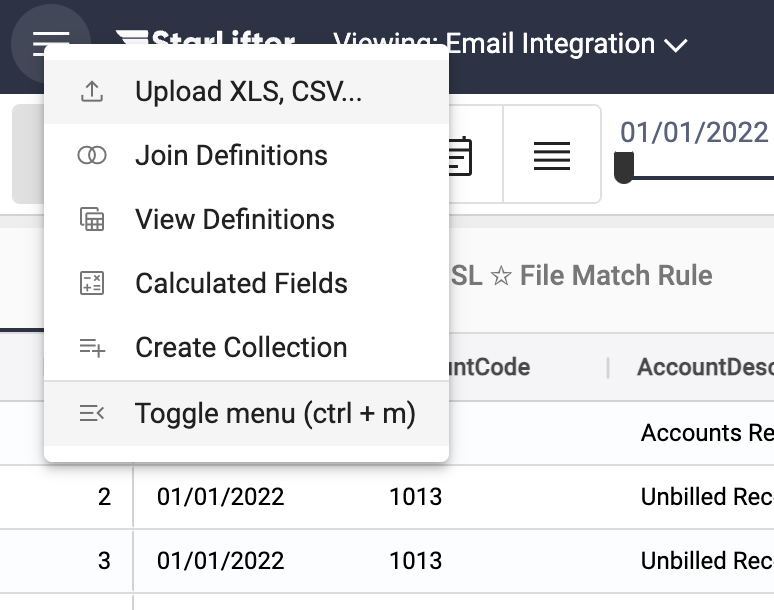
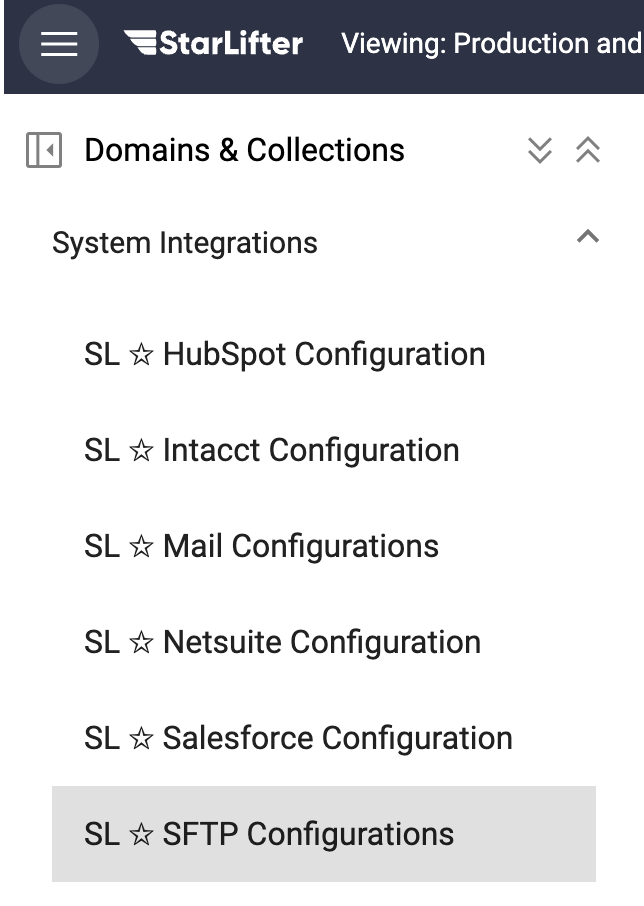
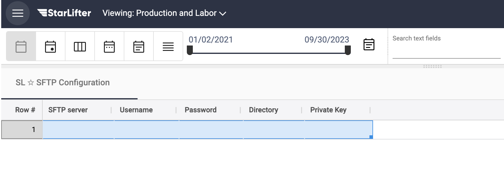
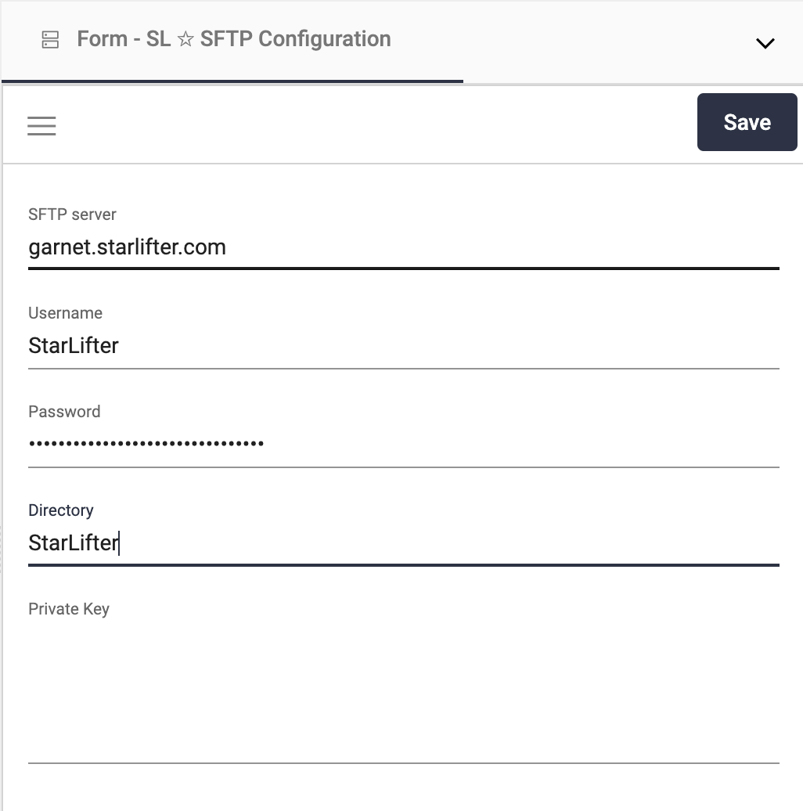

## SFTP Integration

StarLifter makes it easy to upload data using its prebuilt SFTP Integration.

Once an SFTP Integration is created, set up [**File Match Rules**](https://docs.starlifter.io/#/how_to/filematchrules) and a [**Scheduled Job**](https://docs.starlifter.io/#/how_to/scheduledintegrations) to clean and upload the data to the right collection and at the right frequency.

### Upload data using SFTP
1. Acquire the following for your SFTP account:
* SFTP Server
* Username
* Password
* Directory
* Private Key (optional)

2.  From the menu at the upper left of the screen, select **Toggle menu**.

</img>

3. Under **System Integrations**, select **SL ☆ Mail Configurations**.

</img>

4. Double-click, or right-click and select **Insert row** to insert a new SFTP Integration. You can either edit the fields in the row, or right-click on the pencil to open up a form.

</img>

5. Fill in the details for the SFTP Integration. Click **Save**.

</img>

6. Set up [**File Match Rules**](https://docs.starlifter.io/#/how_to/filematchrules) and a [**Scheduled Job**](https://docs.starlifter.io/#/how_to/scheduledintegrations). File Match Rules tell StarLifter where and how to upload the data. Scheduled jobs determine the frequency with which data is uploaded.
