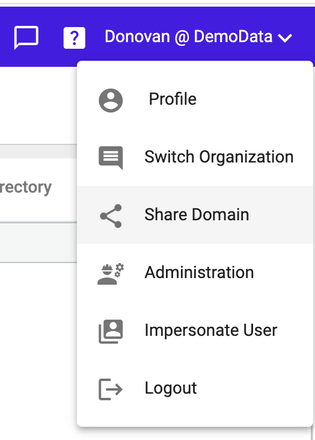
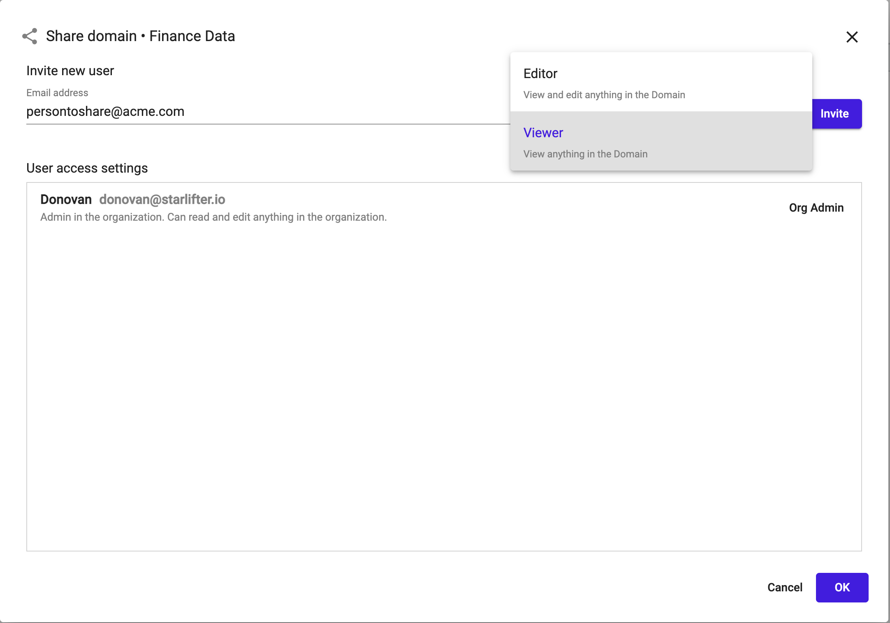
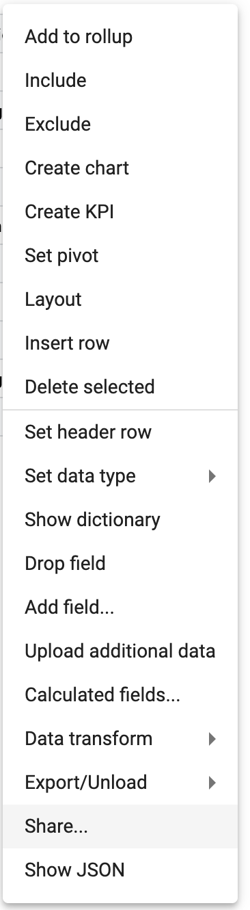
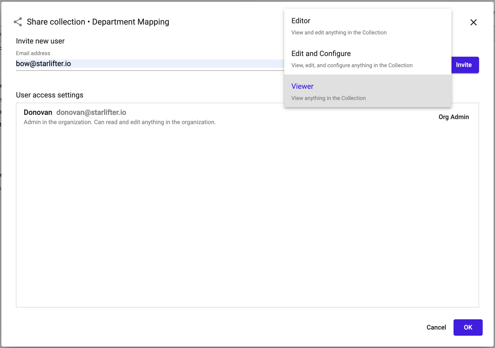
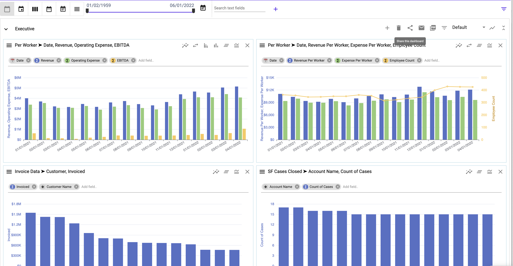
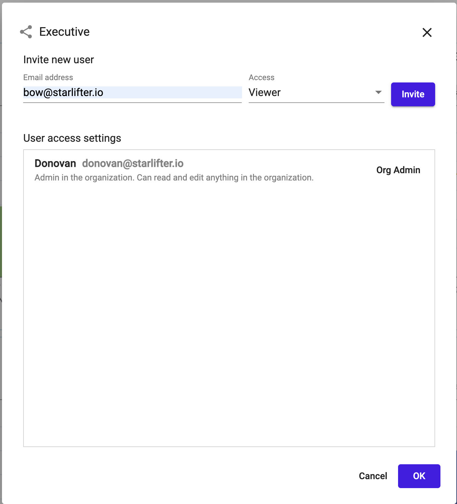

## Sharing Access to Users

There are 3 areas of access that can be granted to other users:
* **Domain** -  All collections and dasboard in a domain
* **Collection** -  A single collection no dashboards
* **Dashboard**  - A single dashboard no collections

### Domain Access

1.	Open the organization menu in the upper right corner and select **Share Domain**.

</img>

2.  Enter the email address of the user and select the level of access.
    * Access level **Viewer** - Can view anything in the domain.
    * Access level **Editor** - Can edit anything in the domain.

</img>

3.  Click **Invite** and an email will be sent to the address provided with an invitation to access the domain.

 

### Collection Access

1.	Right click on the grid of the collection to be shared and select the **Share** option.

</img>

2.  Enter the email address of the user and select the level of access.
    * Access level **Viewer** - Can view anything in the collection.
    * Access level **Edit and Configure** - Can edit and view the data in the collection and update the collection schema.
    * Access level **Editor** - Can edit anything in the collection.

</img>

3.  Click **Invite** and an email will be sent to the address provided with an invitation to access the domain.

 

### Dashboard Access
1.	Select the share icon in the upper right menu of the Dashboard

</img>

2.  Enter the email address of the user and select the level of access.
    * Access level **Viewer** - Can view anything in the dashboard.
    * Access level **Editor** - Can edit anything in the dashboard.

</img>

3.  Click **Invite** and an email will be sent to the address provided with an invitation to access the domain.

