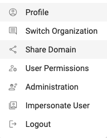
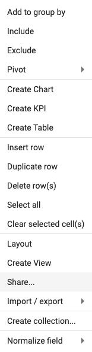
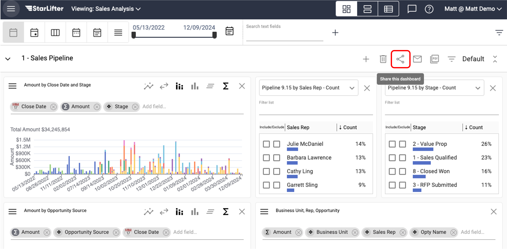

## Sharing Access to Users

**[Video Tutorial]**(https://youtu.be/-z-MOrKmMG4?feature=shared)

There are 3 areas of access that can be granted to other users:
* **Domain** -  All collections and dasboards in a domain
* **Collection** -  A single collection no dashboards
* **Dashboard**  - A single dashboard, and the collection data used to build the dashboard

### Domain Access

1.	Open the organization menu in the upper right corner and select **Share Domain**.

</img>

2.  Enter the email address of the user and select the level of access.
    * **Viewer** - Can view anything in the domain. Viewers can create their own dashboards, but they cannot edit dashboards for other users.
    * **Editor** - Can edit anything in the domain.

</img>

3.  Click **Invite** and an email will be sent to the address provided with an invitation to access the domain.

 

### Collection Access

1.	Right click on the grid of the collection to be shared and select the **Share** option.

</img>

2.  Enter the email address of the user and select the level of access.
    * **Viewer** - Can view anything in the collection.
    * **Edit and Configure** - Can edit and view the data in the collection and update the collection schema (add, edit, and delete fields).
    * **Editor** - Can edit anything in the collection.

</img>

3.  Click **Invite** and an email will be sent to the address provided with an invitation to access the collection.

 

### Dashboard Access
1.	Select the share icon in the upper right menu of the Dashboard

</img>

2.  Enter the email address of the user and select the level of access.
    * **Viewer** - Can view anything in the dashboard and the collections that support the dashboards. Viewers can create their own dashboards, but they cannot edit dashboards for other users.
    * **Editor** - Can edit anything in the dashboard.

</img>

3.  Click **Invite** and an email will be sent to the address provided with an invitation to access the dashboard and underlying collections.

To learn more or ask additional questions, head over to the [StarLifter Community](https://community.starlifter.io).
