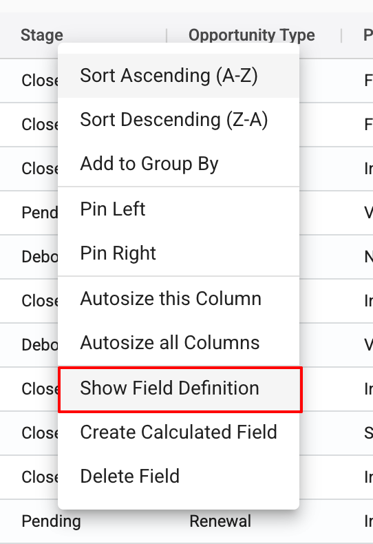
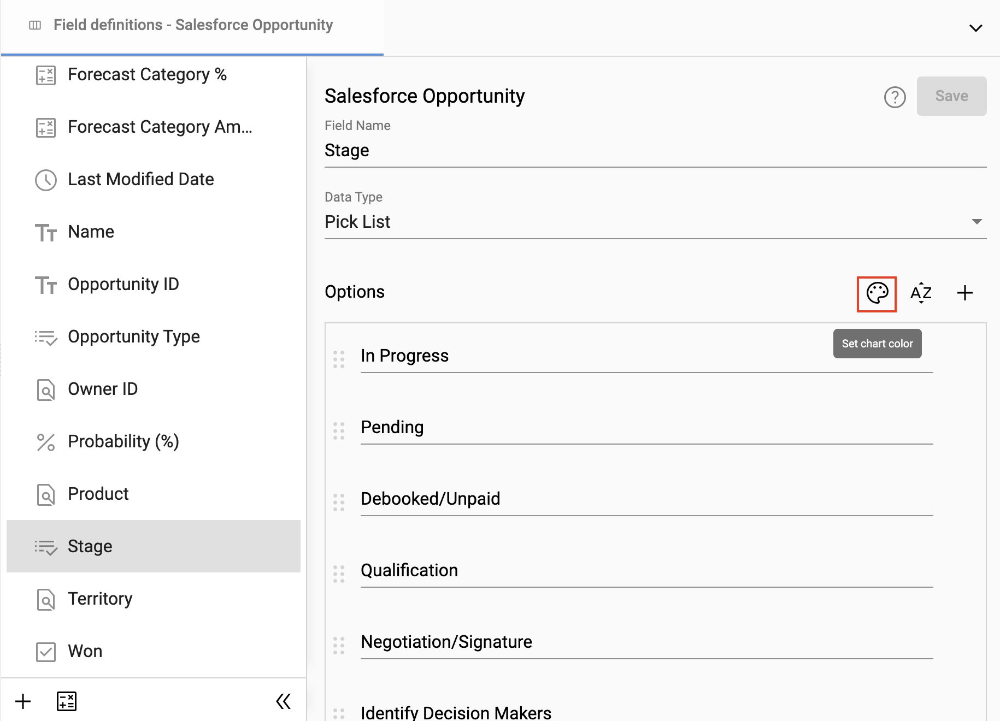
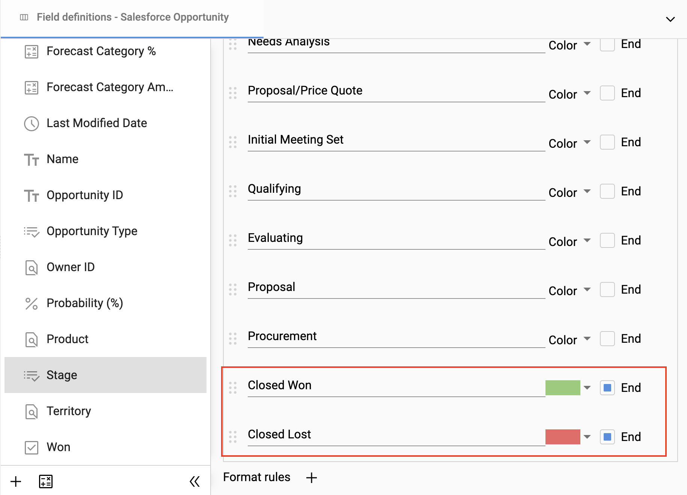
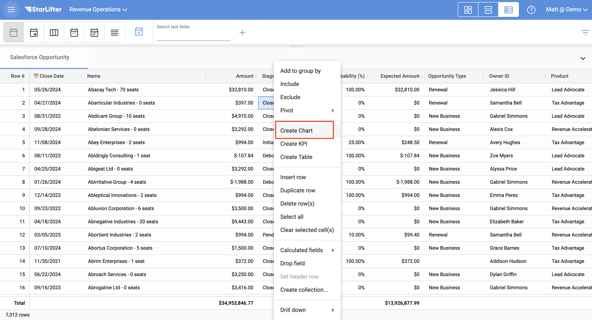
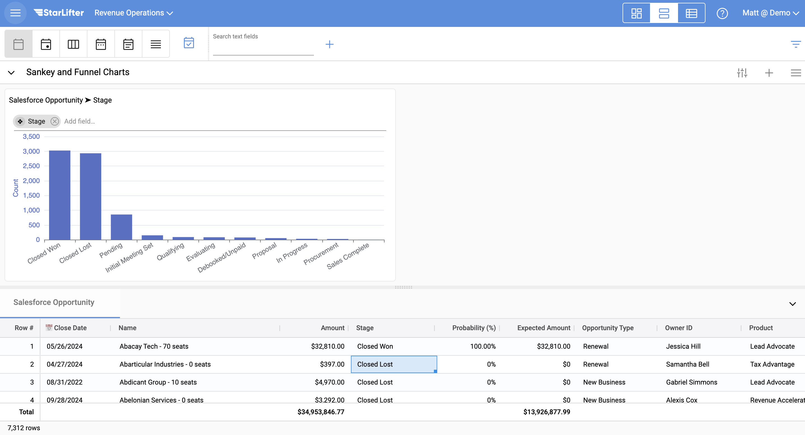
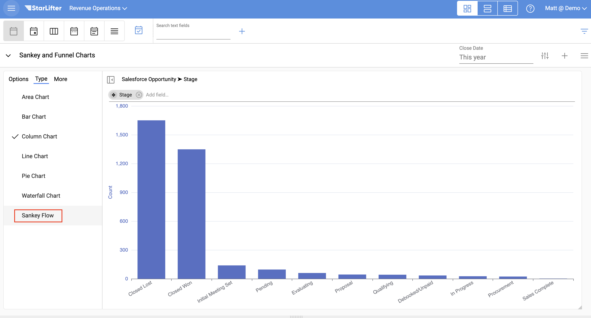
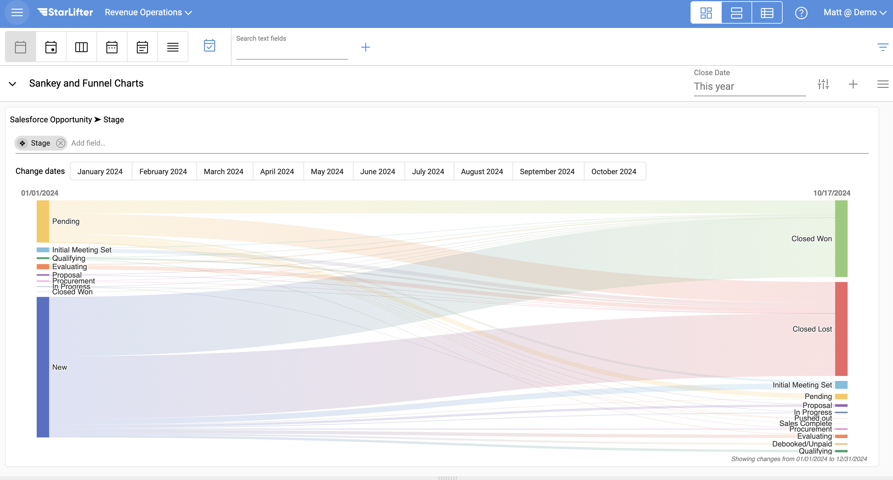
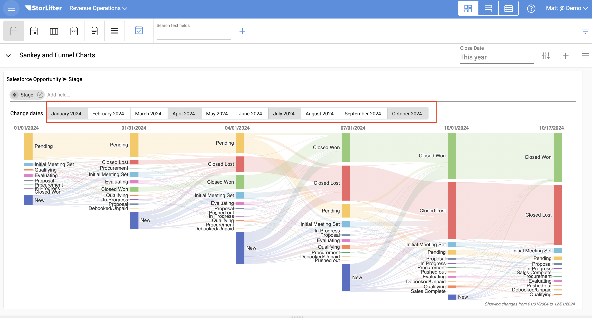
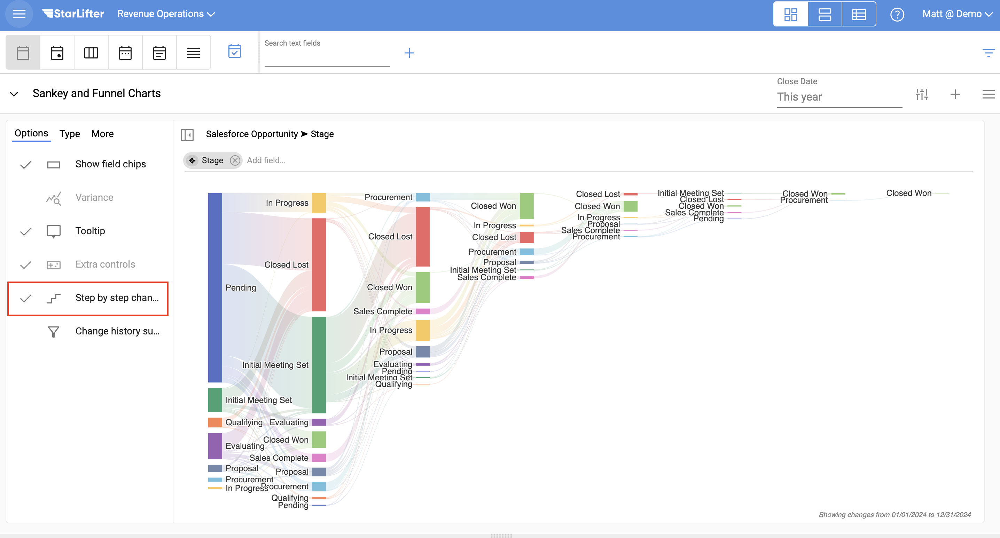
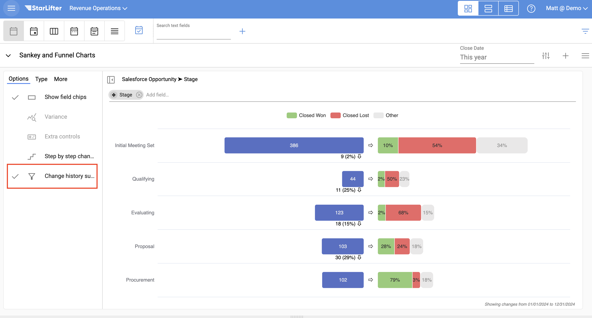

## Stage progression charts

Because StarLifter records changes to your data, we are able to show how your opportunities progress over time using Sankey and Funnel charts.

### Set your stage progression order

1. Right-click on the opportunity collection header, and select **Show fields**. Select the stage field.

</img>

2. Select the color palette icon.

</img>

3. Drag your stages in order, starting with the first stage at the top. Also select **End** for any end state stage.

</img>

### Create a Sankey chart

1. Once your fields are in the correct order, you are ready to create a chart. Right-click on the stage field and select **Create Chart**.

</img>

2. Navigate to your dashboard to view the chart you created.

</img>

3. Edit the chart type to **Sankey Flow**.

</img>

4. The Sankey Flow chart shows how your deals changed stages at the beginning and end of your selected time range.

</img>

5. You also have the option of selecting any point-in-time within your selected time range.

</img>

   

### Other stage progression charts

1. If you are interested in seeing how any of your opportunities progressed during the selected time range, independent of point-in-time, select **Step by step change history** under Options.

</img>

2. To display a Funnel chart, select **Change history summary**.

</img>

