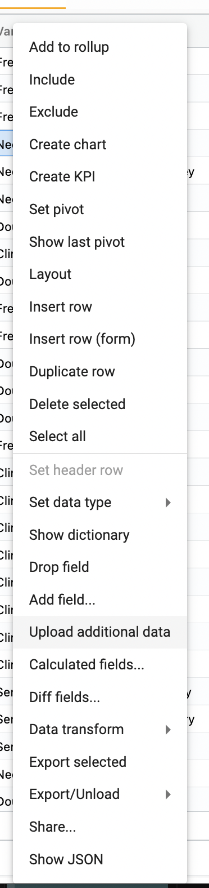
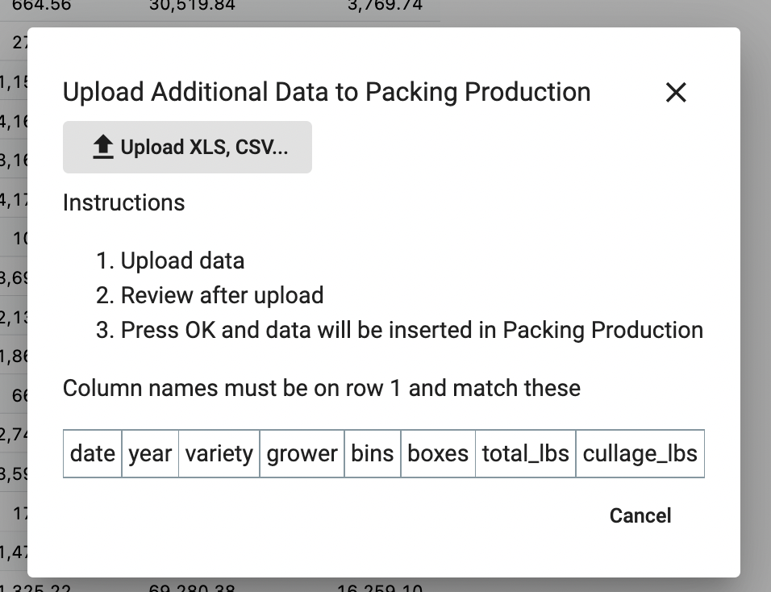
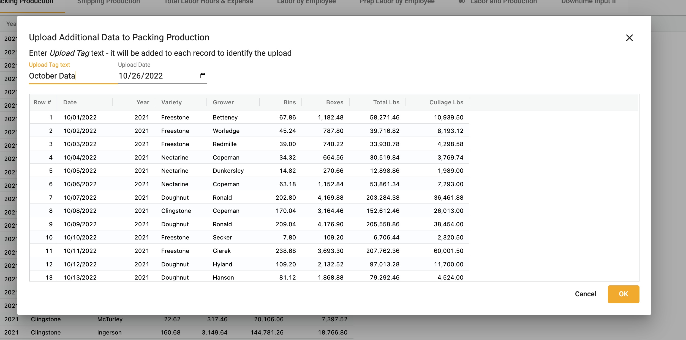
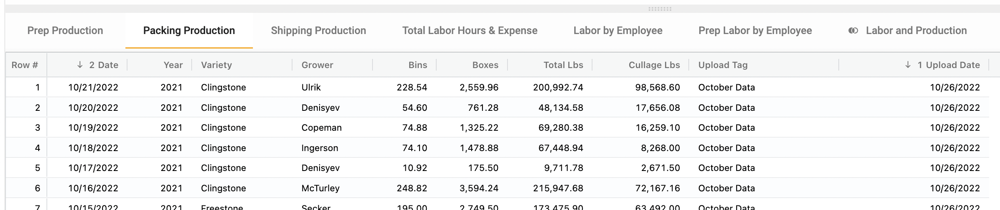

## How to upload data with a date and tag

To add an upload date and tag column to a collection: 

1.	Right click ➔ **Upload additional data**

</img>

2.  Choose a **Upload XLS, CSV...**  

</img>

3.  Add a tag and select an **Upload Date**

</img>

4.  Select **OK**.  

</img>
