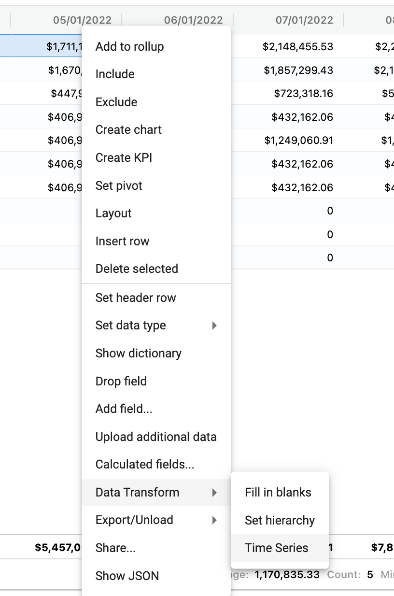
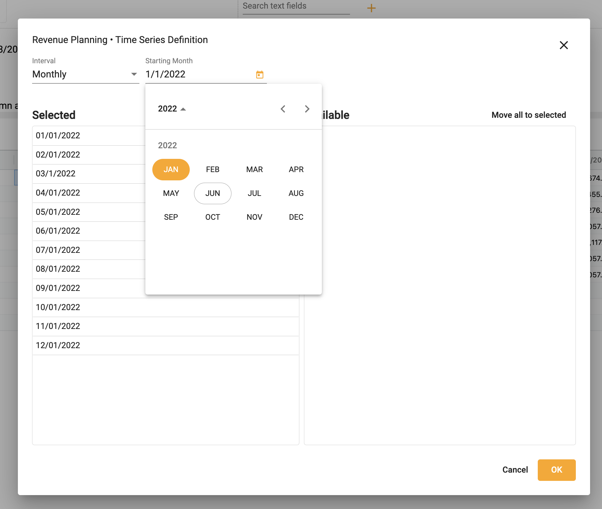
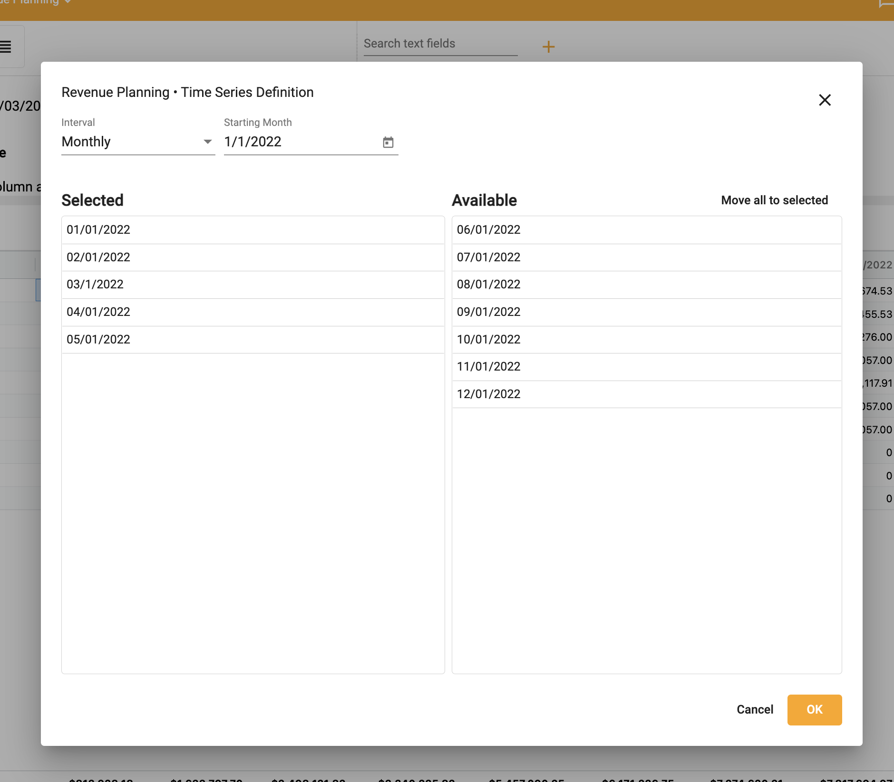
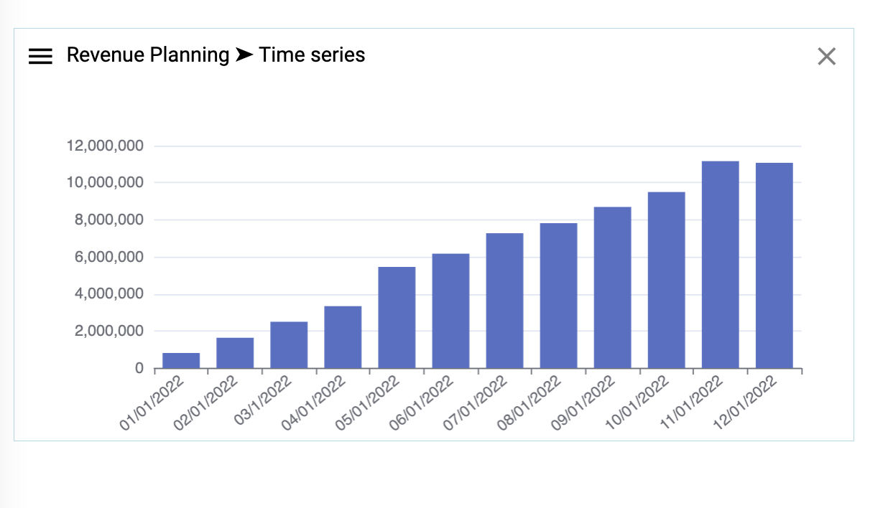

## How to set a time series

To set a time series on columnar data:   
1.	Right click ➔ **Data Transform** ➔ **Time Series**

2.  Choose Intervals
3.  Choose start date

4.  Select columns for series

5.  Select **OK**

To chart a time series:
1.  Right click ➔ **Create chart** 

