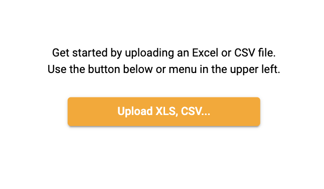

### Upload data
1.  Select **Upload XLS, CSV...**

</img>

2.  Drag or select a file to upload

</img>

3.  The workbook file name is saved as the title of the domain
4.  Choose to add or ignore each collection (worksheet). Each line will create it's own collection within Starlifter.

    **Note**: The name of the collection comes from the name of the worksheet in the original file. You can change the name of the collection by editing the **Label** field 

</img>

5.  Select **GO**

### Updating data
1.  Select **Upload XLS, CSV...**

</img>

2.  Drag or select a file to upload

</img>

3. Choose whether to **Select existing domain** or **Create new domain**.
* Use **Select existing domain** when you'd like to create additional collections to interact among your already existing collections. 
* Select **Create new domain** when you want to look at your collection on it's own. It is rare to select **Create new domain**.

4. Choose whether to add, replace, append, or ignore each sheet.
* **Add**: Creates a new collection and gives the option to rename the collection. *Note: if another collection exists with the same name, you MUST rename the collection in the **Target Collection** field.*
* **Replace**: Deletes and replaces the selected target collection
* **Append**: Adds data on to the selected target collection *Note: this action does not control for duplicates*
* **Ignore**: Ignores complete sheet and does not upload

5.  Select **GO**
