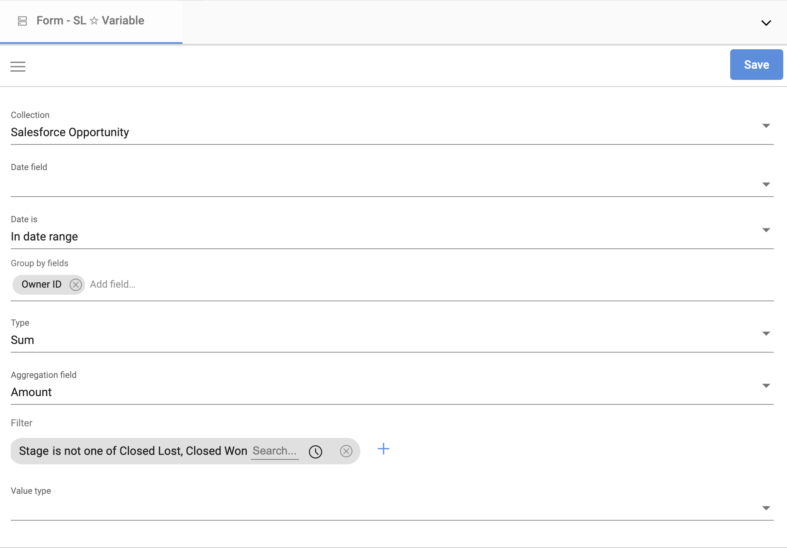

## Aggregate data with variables

You are likely already familiar with the fact that Starlifter aggregates data when you create charts and tables dashboards, or when exploring your data using Group By. But what if you need to use that aggregation on use it in a calculation? In that situation, you should use variables.

In the example below, we will set up a variable to aggregate open pipeline by opportunity owner. We will then add a calculated field to display the open pipeline in the user collection.

### Create a variable

1. 

</img>

2. 

</img>

3. 

</img>

4. 

</img>

5. 

</img>

### Use the variable in a calculation

1. 

</img>

2. 

</img>

3. 

</img>

4. 

</img>

To learn more or ask additional questions, head over to the [StarLifter Community](https://community.starlifter.io).
