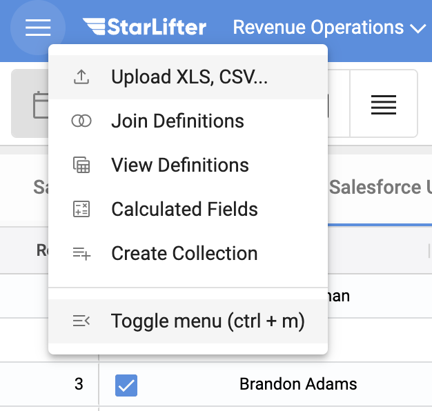
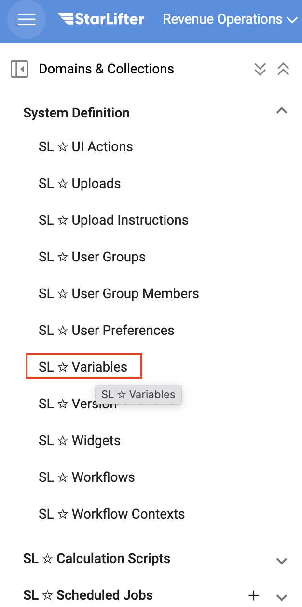
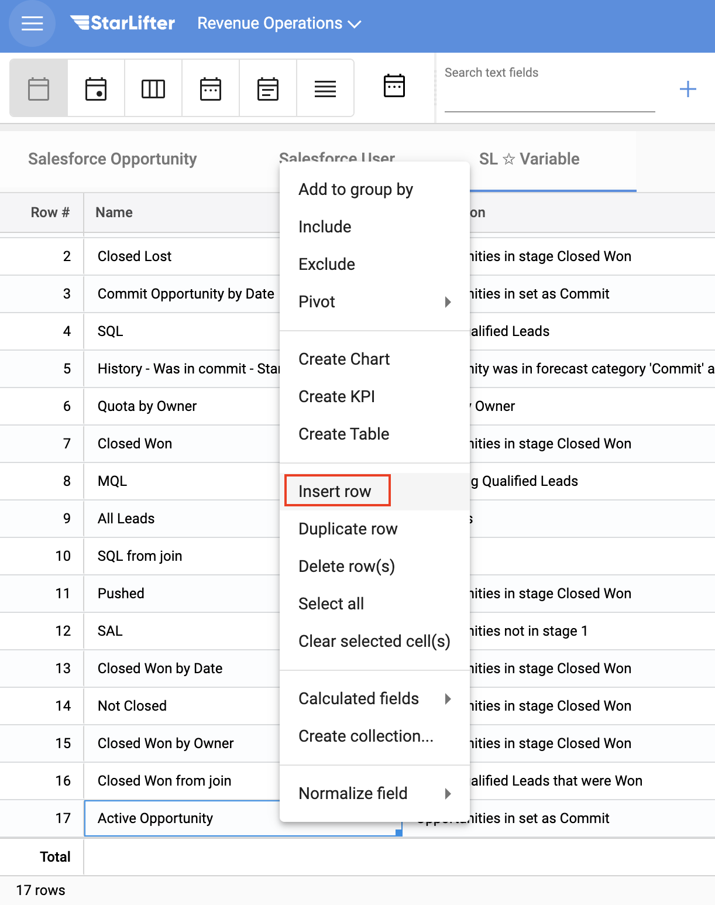
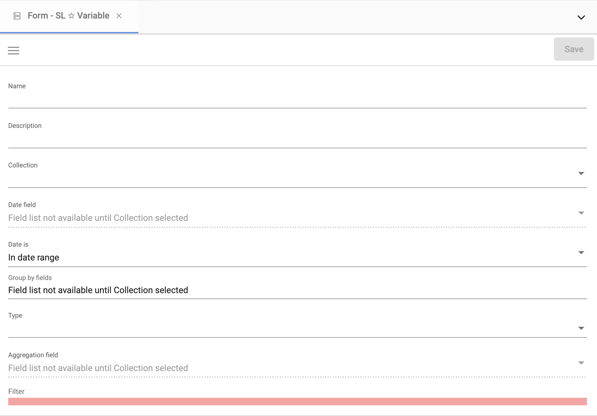
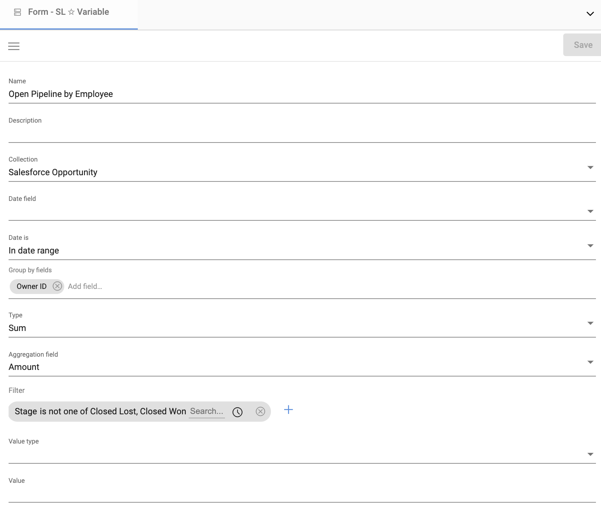
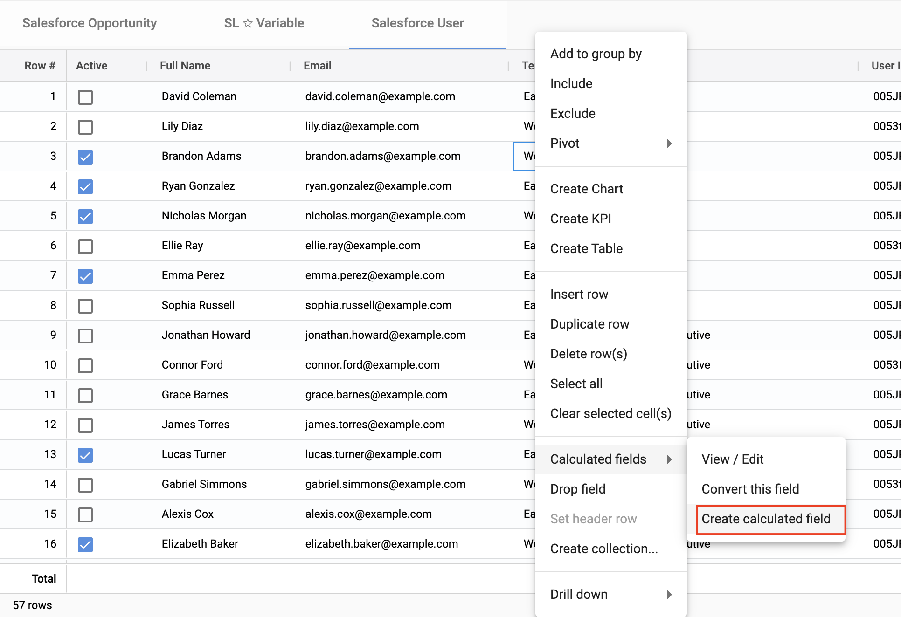
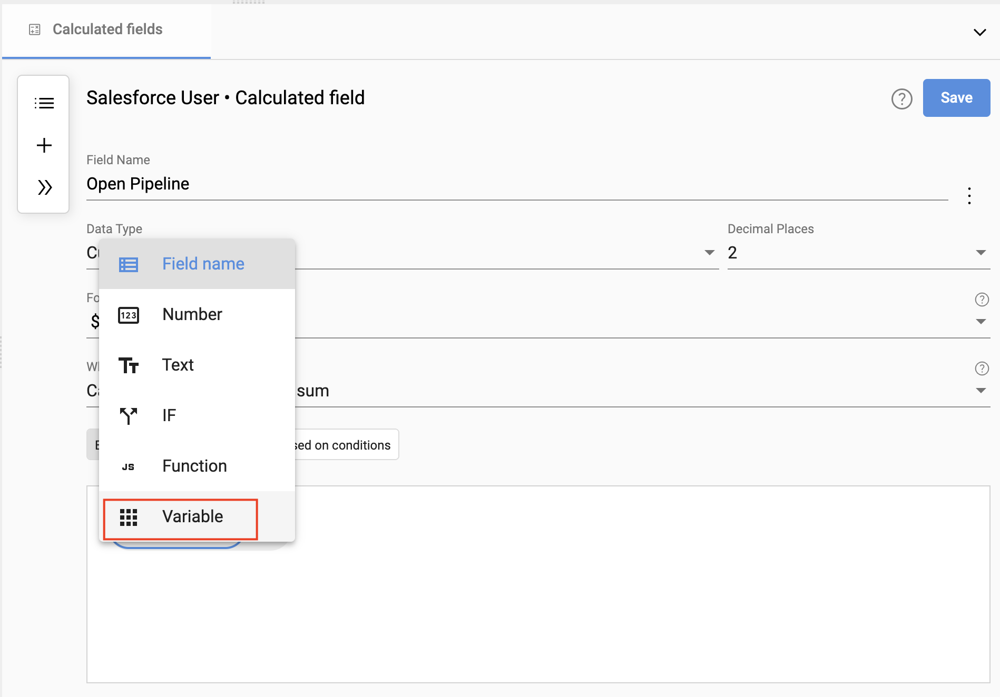
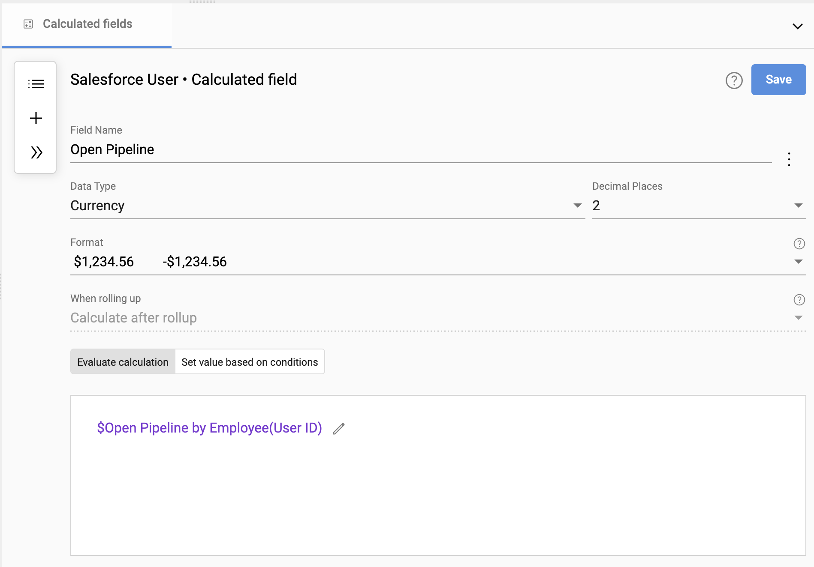
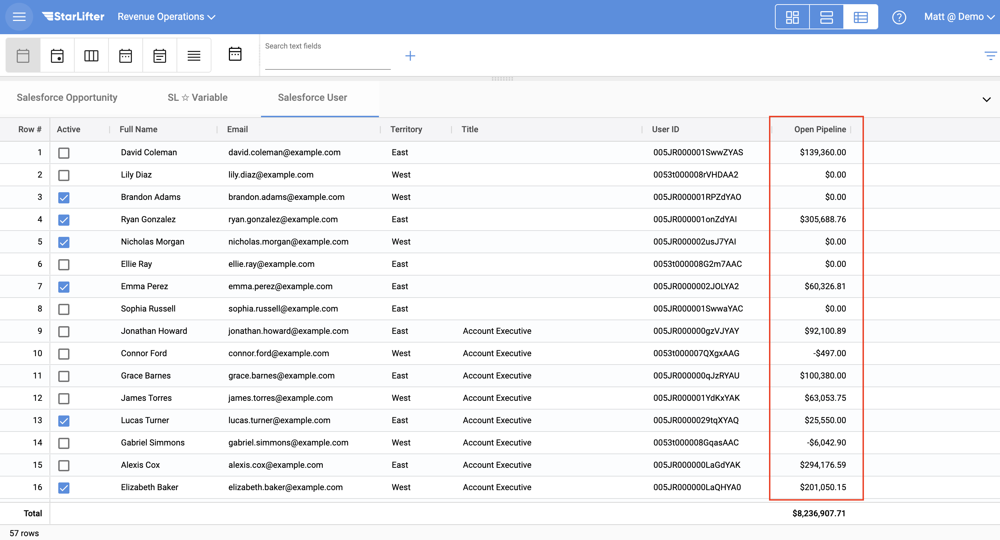

## Aggregate data with variables

You are likely already familiar with the fact that Starlifter aggregates data when you create charts and tables dashboards, or when exploring your data using Group By. But what if you need to use that aggregation in a calculation? In that situation, you should use variables.

In the example below, we will set up a variable to aggregate open pipeline by opportunity owner. We will then add a calculated field to display the open pipeline in the user collection.

### Create a variable

1. From the menu at the upper left of the screen, select Toggle menu.

</img>

2. Select **SL ✩ Variable** under the System Definition dropdown.

</img>

3. Right-click and select **Insert row** to add a new variable. You can either edit the variable in-line, or select the pencil to open the form.

</img>

4. Either edit the variable in-line, or select the pencil to open the form.

</img>

5. Fill in the following information for the variable. Note that not every field needs to be filled out.

* **Name:** The name of your variable
* **Description:** Helpful description about the variable so that future users understand what it is
* **Collection:** The collection from which data will be aggregated
* **Date field:** The date field used for the date range to be aggregated
* **Date is:** Whether the aggregation should include records that are **In date range** or **Note in date range**
* **Group by fields:** The fields that determine how the aggregation will be grouped. Note that you can include multiple fields.
* **Type:** How the data sould be aggregated (average, max, sum, count, etc)
* **Aggregation field:** The field to aggregate
* **Filter:** Filter to the records that should be aggregated
* **Value Type:** Data type for the variable
* **Value:** Hard-coded output for the variable

</img>

### Use the variable in a calculation

1. Right click in the user collection grid, and select **Calculated fields → Create calculated field**

</img>

2. In the calculation UI, select **Variable**.

</img>

3. Select the variable you just created, and select any **Group by fields**. Click **Save**.

</img>

4. The new calculated field now appears in the collection. As the open pipeline by user changes, the calculated field will update as well.

</img>

To learn more or ask additional questions, head over to the [StarLifter Community](https://community.starlifter.io).
