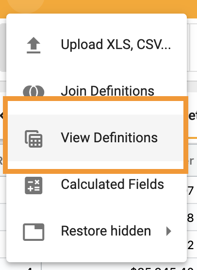
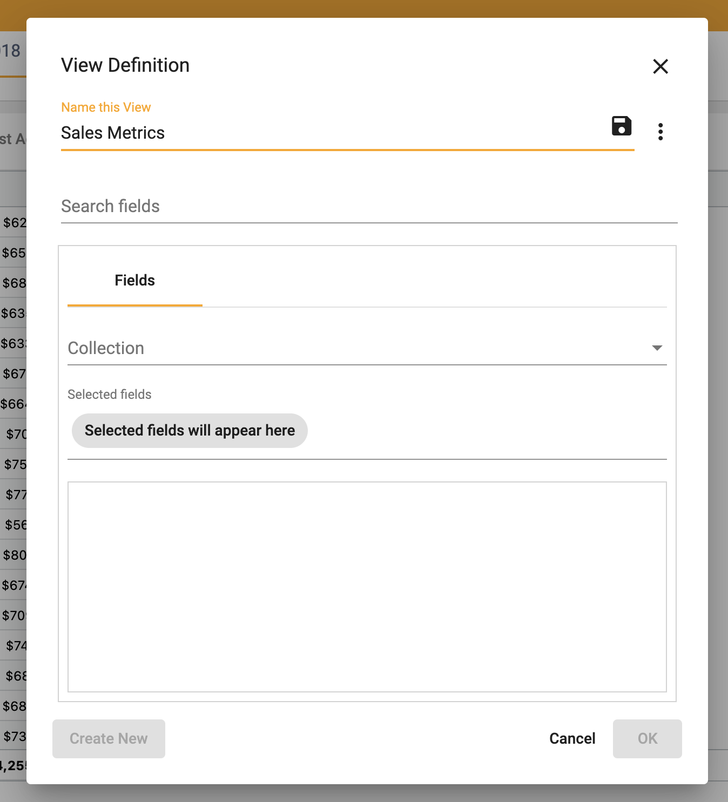
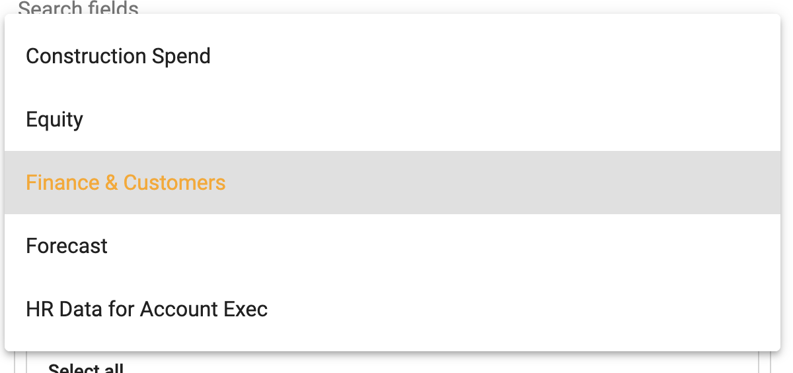
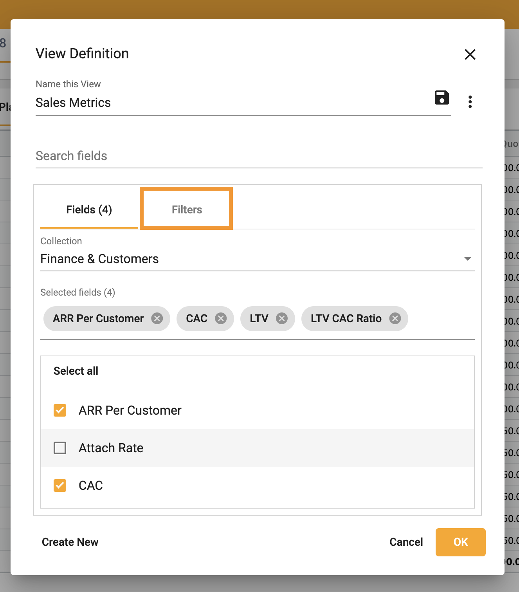
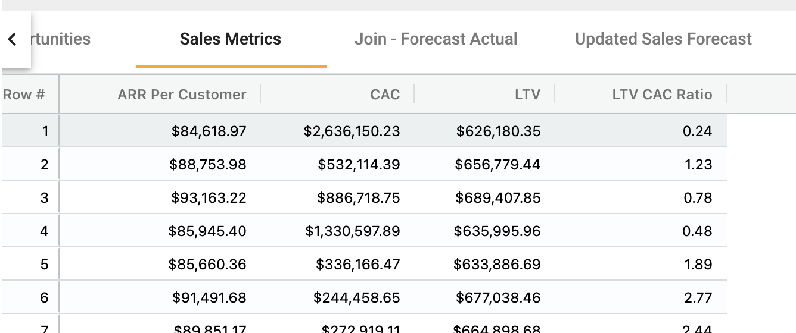
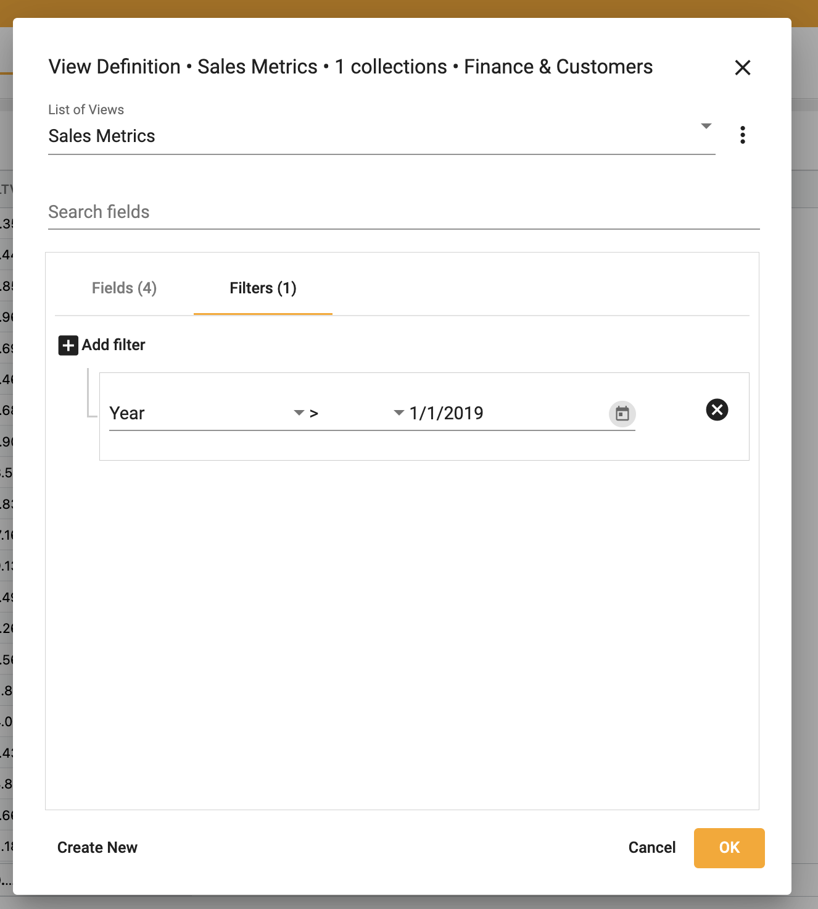

## How to create a view

A view is a group of columns from a collection or join.  It is used to limit the number of columns in a collection.

To create a view:  
1.	Right click ➔ **View Definitions**

</img>

2.  Name the view

</img>

3.  Select the collection

</img>

4.  Select the fields

</img>

5.  Select **OK**

6.  The view is visable as a collection

</img>

Filters may be applied to a view to limit the data within the rows.

To filter a view:

1. Select **Filters**

</img>

2. Apply desired filters

</img>

3.  Select **OK**

