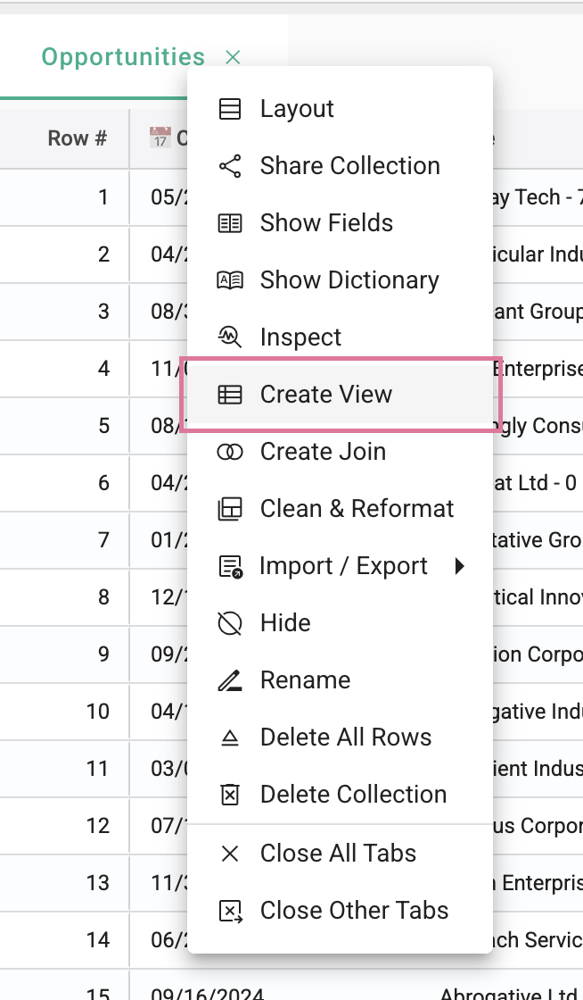
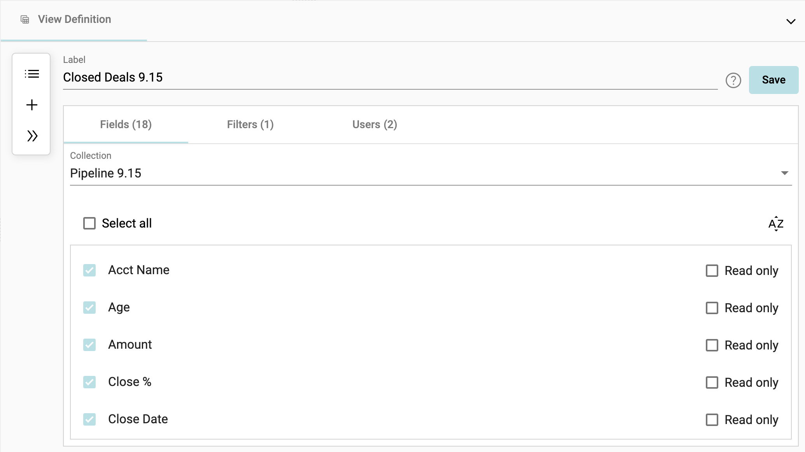
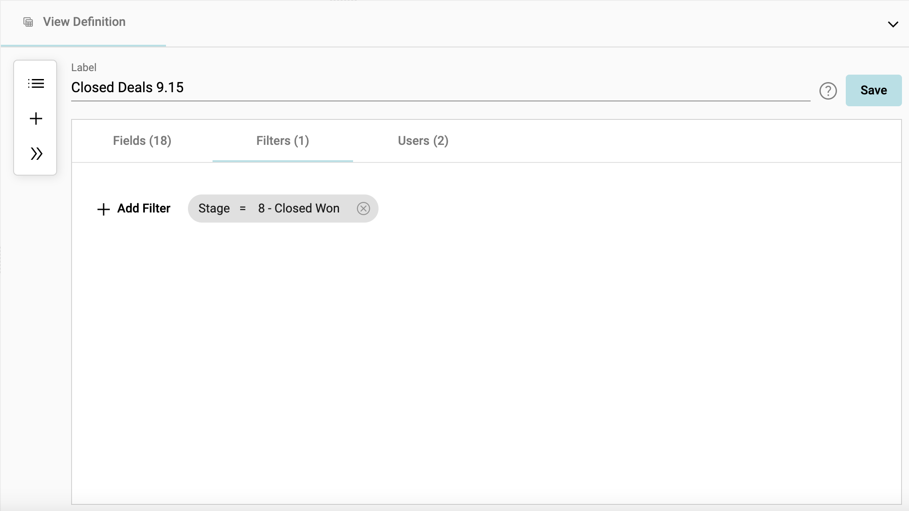
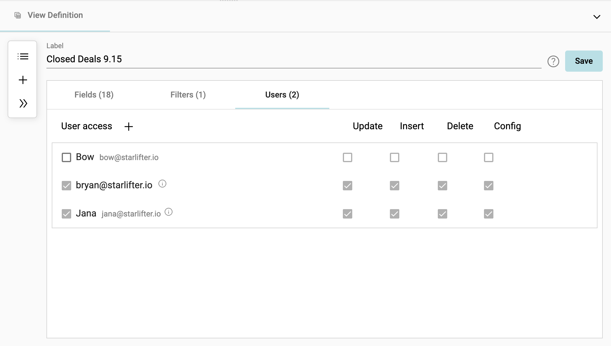
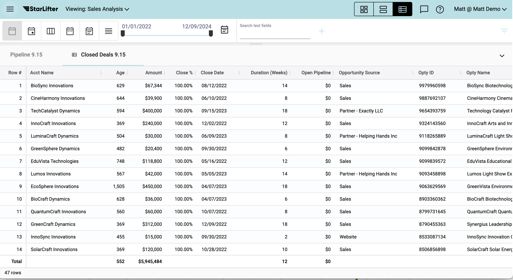
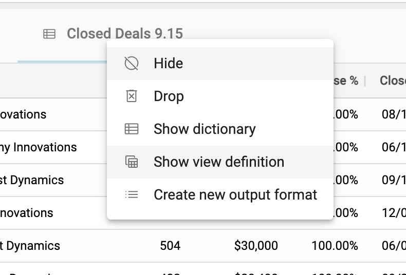
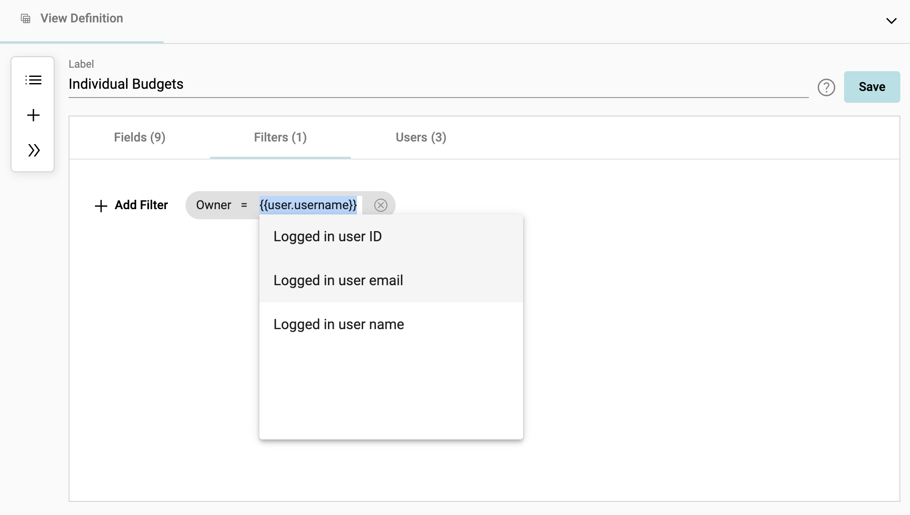
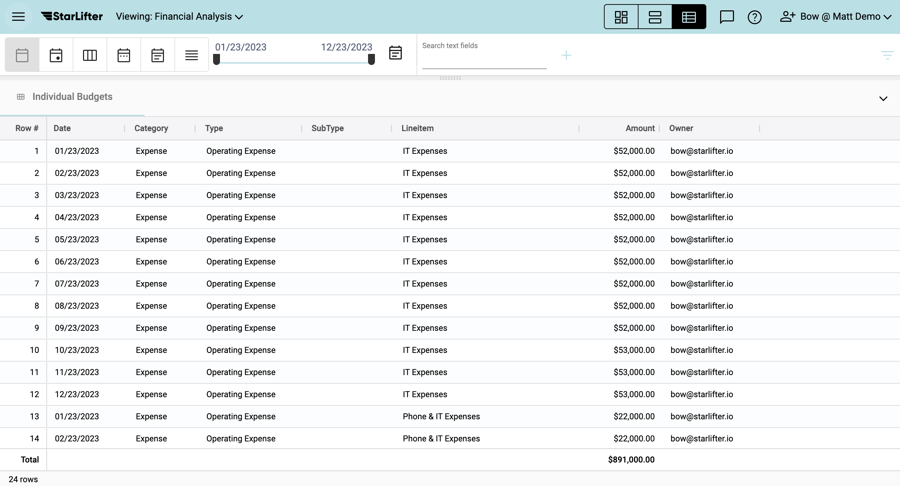

## How to create a view
[**Video Tutorial**](https://youtu.be/nSEy7wmTVD0?feature=shared)

Views are a way to save a filtered collection as a new collection. Collections can be segmented on fields, filters, and/or user permissions.

### To create a view:  
1.	Right click in the grid of a base collection ➔ **Create View**.

</img>

2.  Name the view and select the fields you'd like to show in the view. Choose whether you'd like to designate fields as **Read Only**.

</img>

3.  Add a filter.

</img>

4.  Set user permissions for the view.

</img>

5.  Click **Save**. The view is now available as a new StarLifter collection. If a collection is a view, there will be a piece of paper icon on the right of the collection title. 

</img>

6.  To edit the view, right click on the view header and select **Show view definition**.

</img>

### Filter by user:  
1. When creating a view, you also have the option to filter by active user. For this feature to function, your base collection must contain a field with a user ID, email, or StarLifter user name.

</img>

2. In the example above, the view will only contain rows where the Owner field contains the email of the logged-in user.

</img>

To learn more or ask additional questions, head over to the [StarLifter Community](https://community.starlifter.io).
