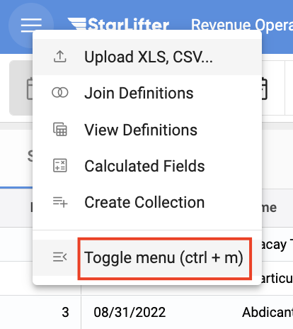
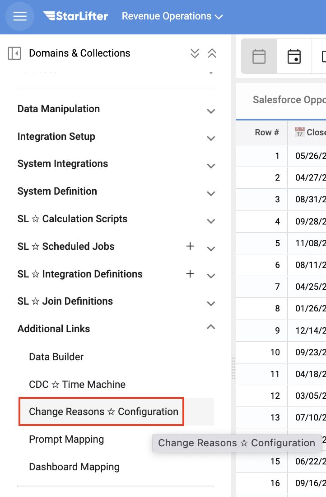
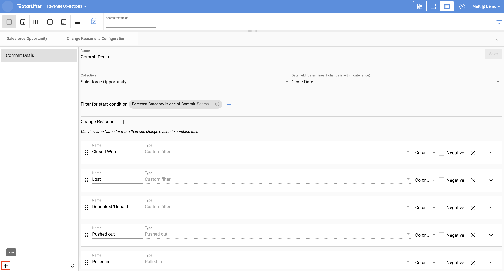
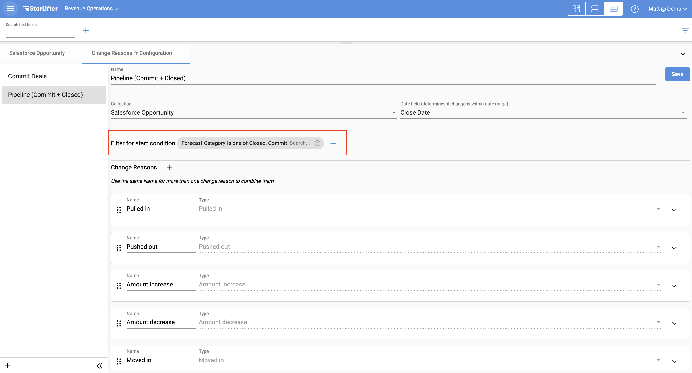
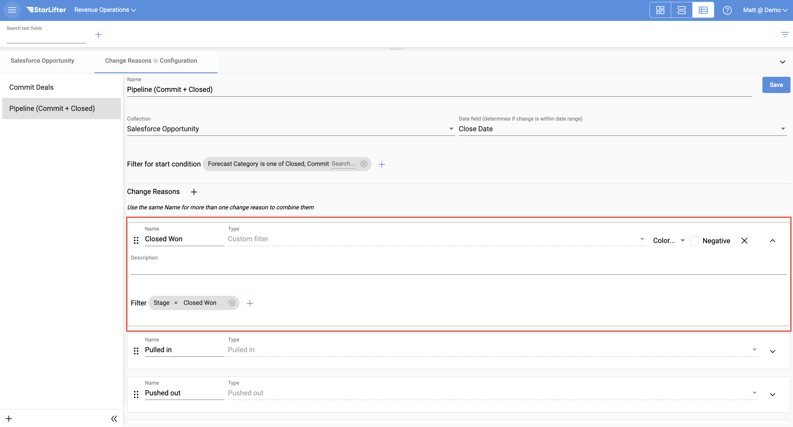
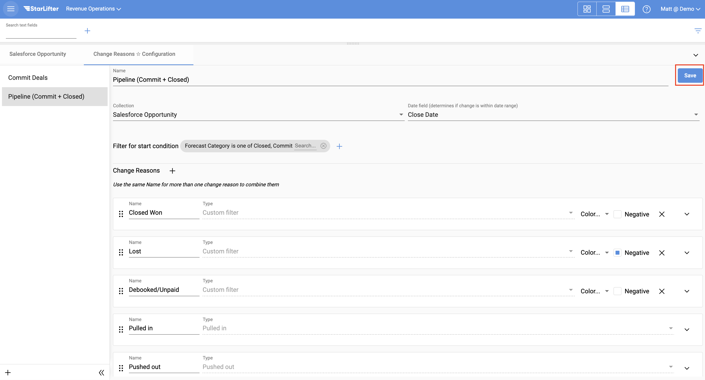
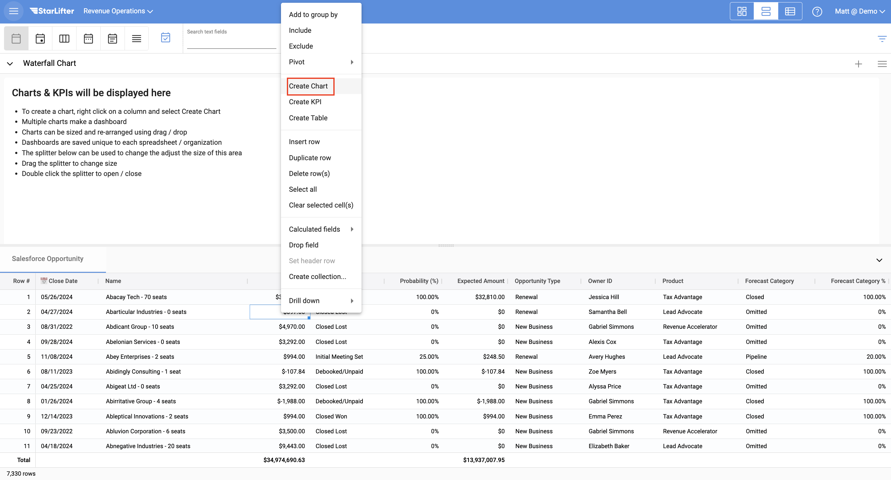
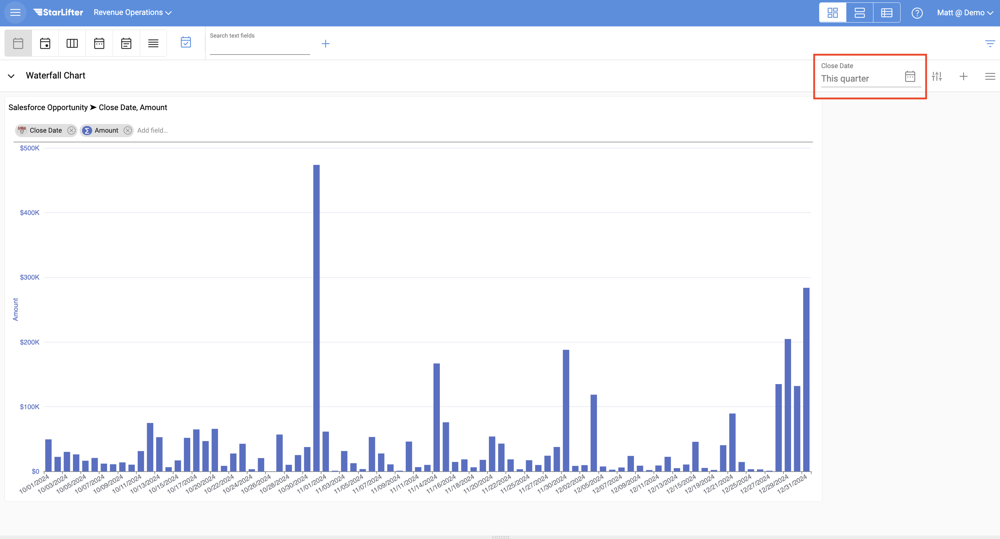
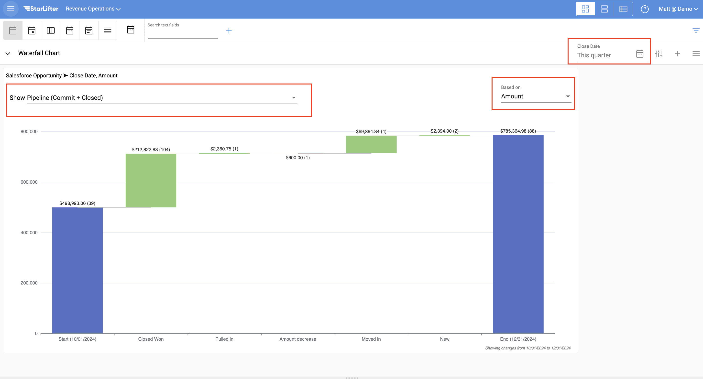
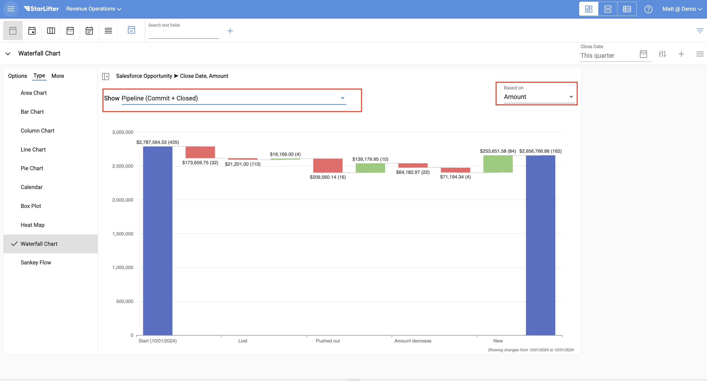

## Create a waterfall chart

Because StarLifter records changes to your data, you are able to view these changes over time in the form of a waterfall chart.

To create a waterfall chart in StarLifter users must:
1. Filter to a start condition
2. Define the change reasons to display on the chart
3. Create the chart on a dashboard
4. Define the date range

### Configure change reasons

1. From the menu at the upper left of the screen, select **Toggle menu**.

</img>

2. Select **Change Reasons ✩ Configuration** under the Additional Links dropdown.

</img>

3. Click the **+** to add a new configuration.

</img>

4. Add a filter for your start condition. In the example below, the left bar of the waterfall will include all records where Forecast Category was Commit or Closed at the beginning of the time range.

</img>

5. Several change reasons appear by default. Add any change reasons by clicking the **+** and defining the type of change you wish to display. In the example below, any opportunities that moved into Stage = Closed Won during the time range will be captured.

</img>

6. Once all your change reasons are defined, click **Save**.

</img>

### Create a waterfall chart

1. Right-click in the grid, and select **Create Chart**.

</img>

2. Define a time range on the dashboard. Waterfall charts need a defined time range to display any data.

</img>

3. Change the chart type to Waterfall.

</img>

4. Select the change configuration, value field, and date range.

</img>

To learn more or ask additional questions, head over to the [StarLifter Community](https://community.starlifter.io).
