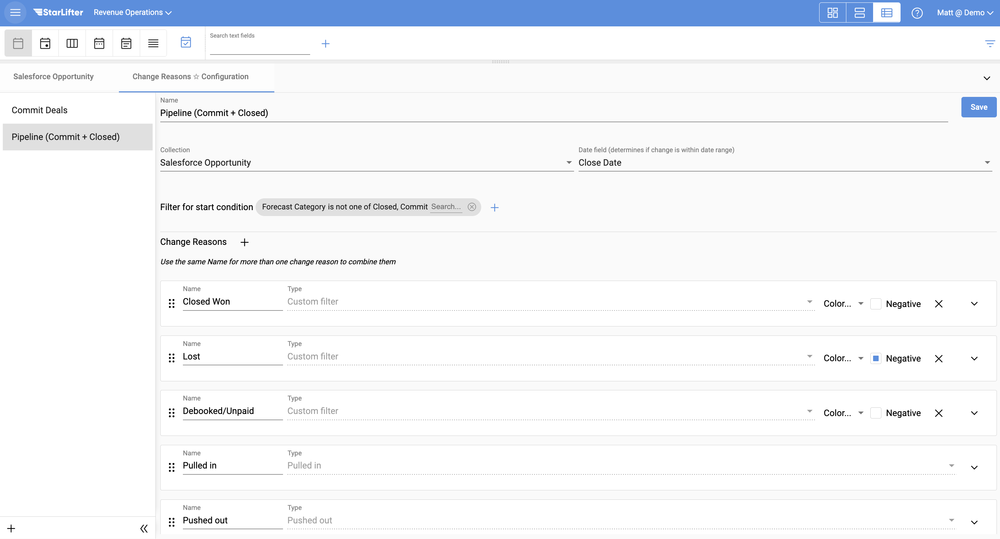

## Create a waterfall chart

Because StarLifter records changes to your data, you are able to view these changes over time in the form of a waterfall chart.

To create a waterfall chart in StarLifter users must:
1. Filter to a start condition
2. Define the change reasons to display on the chart
3. Create the chart on a dashboard
4. Define the date range

### Configure change reasons

1. 

</img>

2. 

</img>

3. 

</img>

4. 

</img>

5. 

</img>

6. 

</img>

7. 

</img>

### Create a waterfall chart

1. 

</img>

2. 

</img>

3. 

</img>

4. 

</img>

To learn more or ask additional questions, head over to the [StarLifter Community](https://community.starlifter.io).
