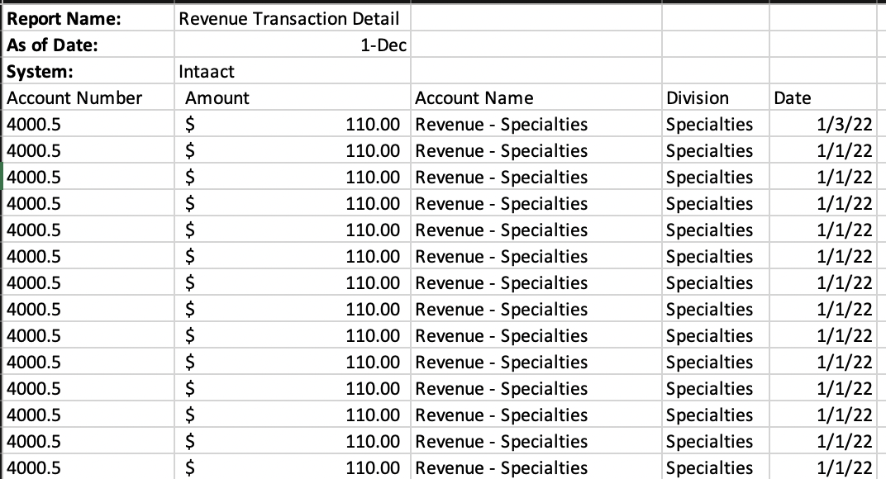
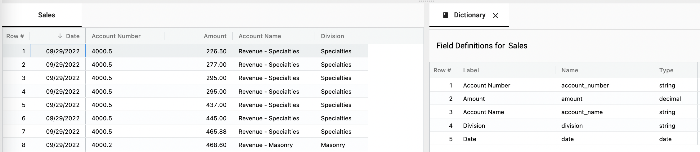

## Why to set a header row

Setting the header row defines the fields in a collection.  When uploading data with informational rows (similar to the report shown below), the user will need to set a header row.

</img>

Once the header row has been set, the values have been defined in the dictionary.

</img>

Now that the fields have been defined, they may be used in calculations (Profit = Revenue - Expenses), to filter views and create joins.

Review this article to learn [**how to set the header row**](https://docs.starlifter.io/#/how_to/setheader).
