## Send a scheduled email from Windows via Powershell
You can use PowerShell to send and email with an attachment to a designated StarLifter email address.

### Create the Poweshell script

Open the Powershell environment by searching for Powershell in the Windows search and selecting Windows Powershell ISE.

Select File --> New from the taskbar menu to create a new Powershell doucument

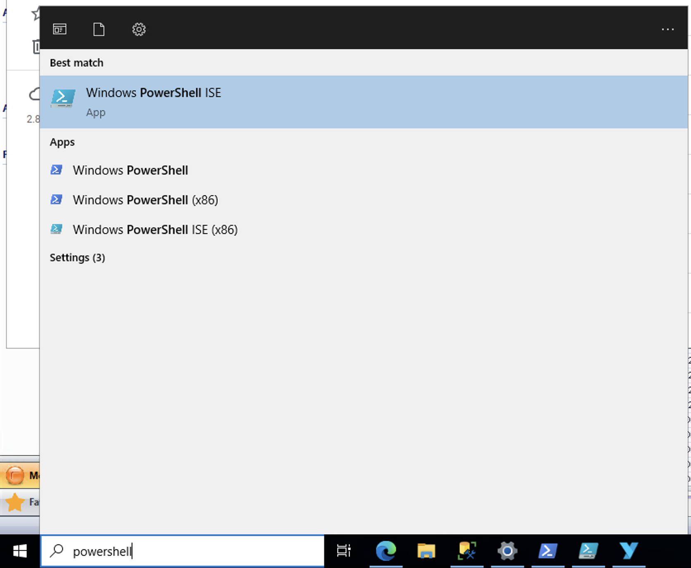</img>

Select File --> New from the taskbar menu to create a new Powershell doucument

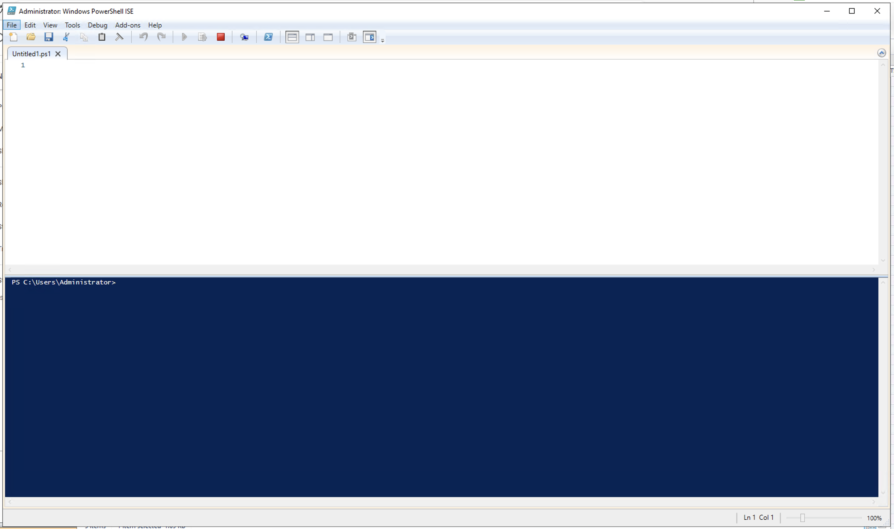</img>

Copy/Paste the example Powershell script from section below [Example](#example-powershell-command) and change the values in the brackets.

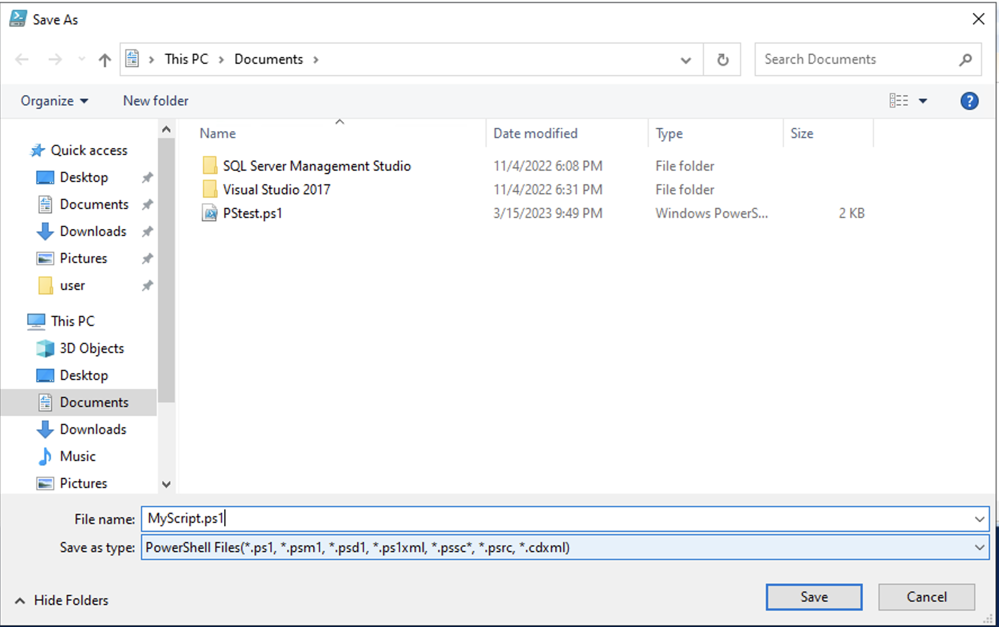</img>


### Create a Windows scheduled task to run the Powershell command


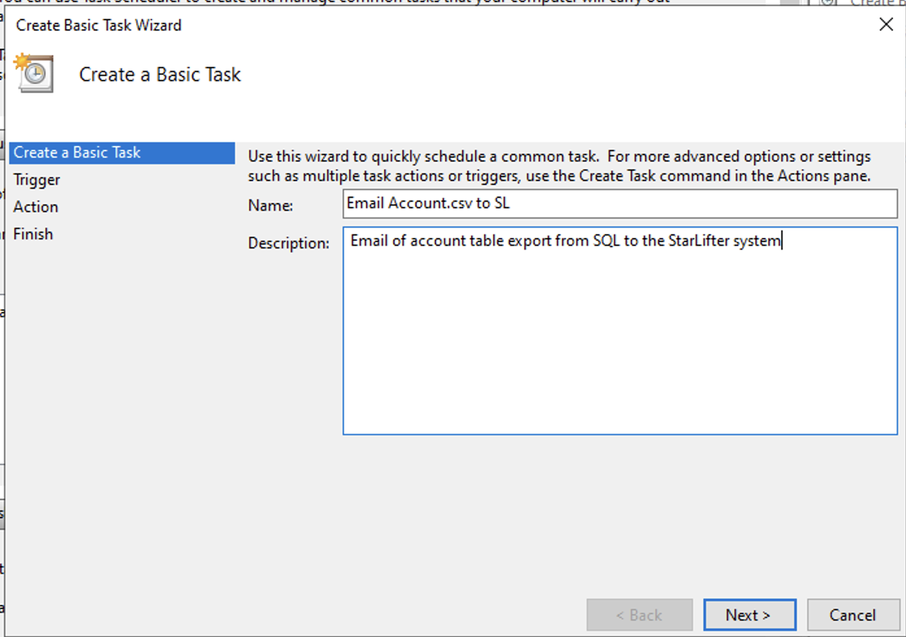</img>

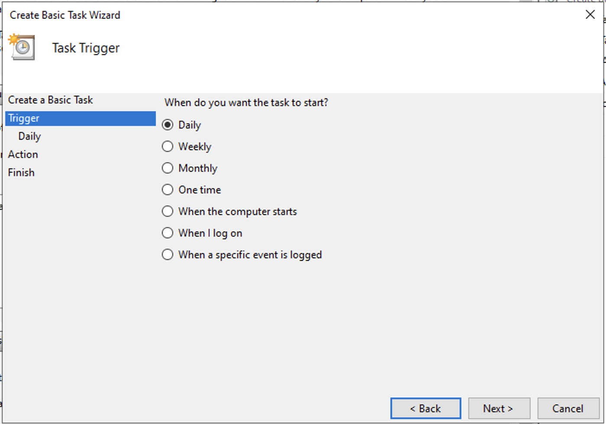</img>

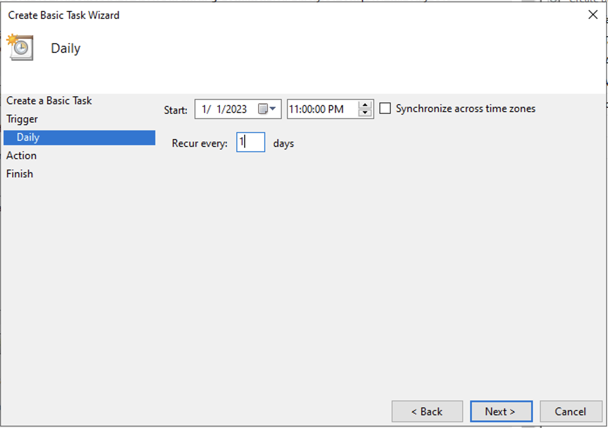</img>

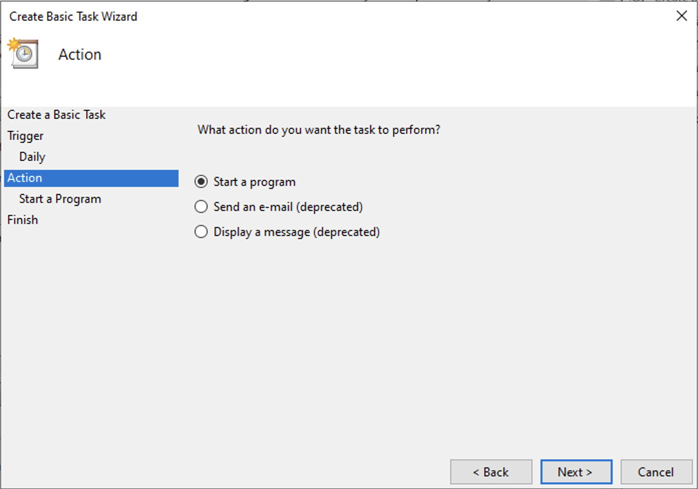</img>

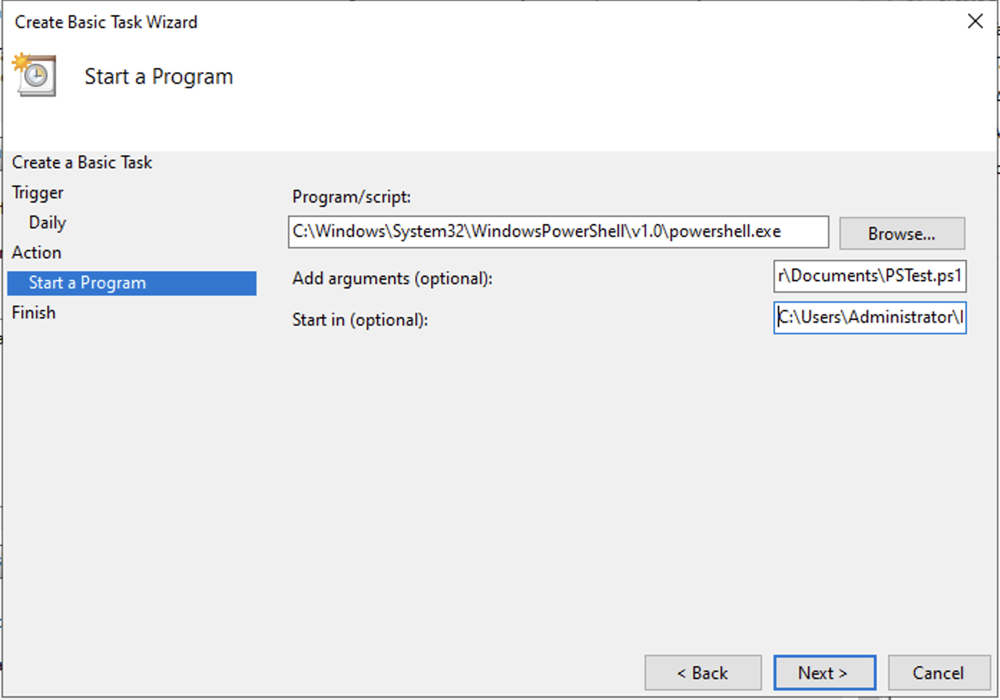</img>

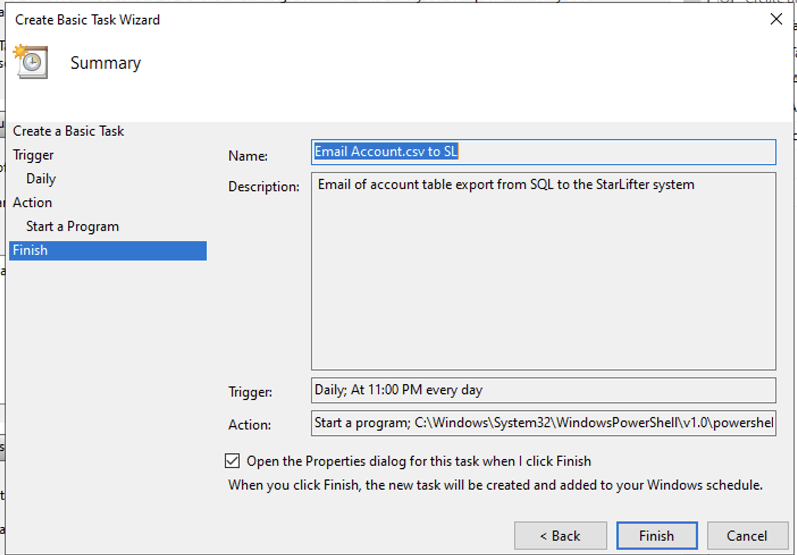</img>

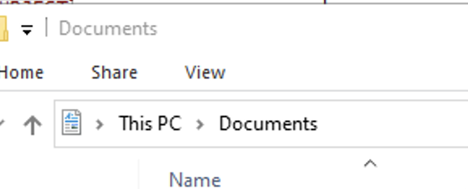</img>

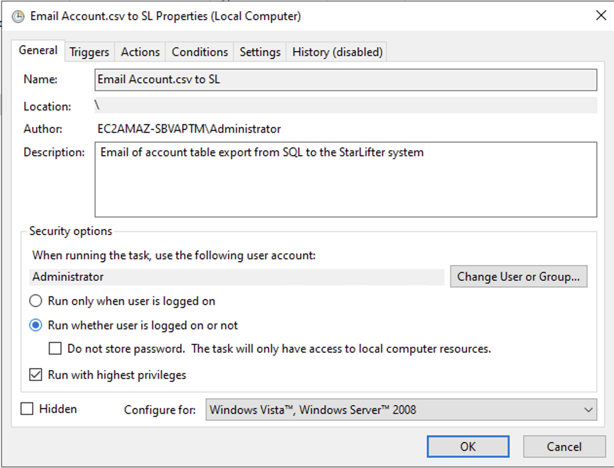</img>

### Example PowerShell command 
The following example uses a Gmail email address to send the email.
*Items in brackets [] need to be replaced.*

```
Send-MailMessage -From "[SEND EMAIL]" `
                 -To "[RECEPIENT EMAIL]" `
                 -Subject "[SUBJECT]" `
                 -Body "[BODY]" `
                 -Attachment "[PATH OF ATTACHEMENT]" `
                 -SmtpServer [SMTP SERVER] `
                 -Port 587 `
                 -UseSsl `
                 -Credential (New-Object `
                   -TypeName System.Management.Automation.PSCredential `
                   -ArgumentList "[EMAIL USERNAME]", `
                   (ConvertTo-SecureString `
                     -String "[EMAIL PASSWORD]" `
                     -AsPlainText -Force))

```
