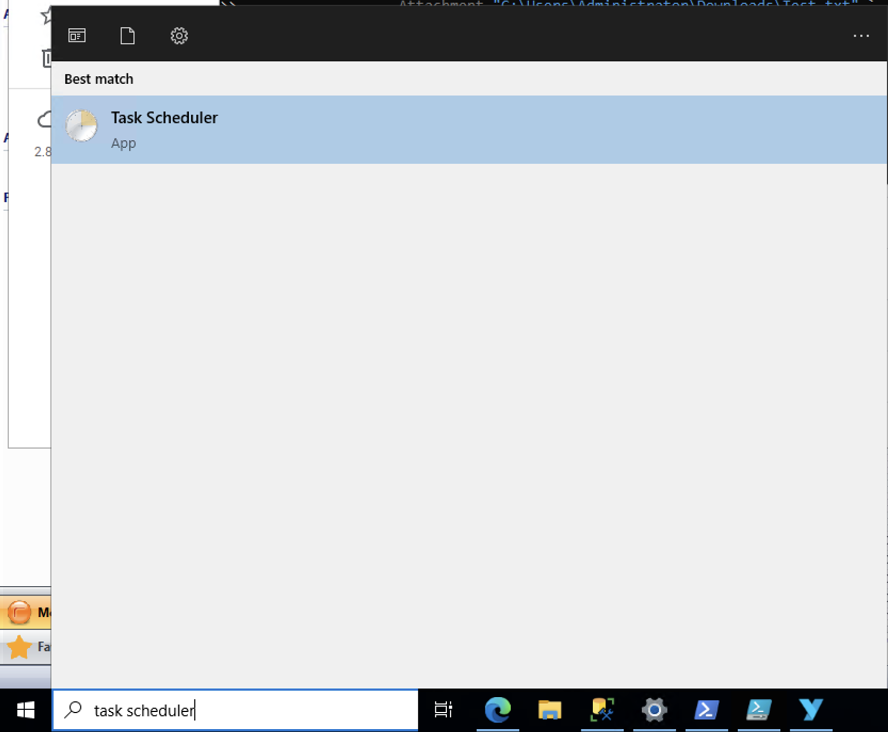
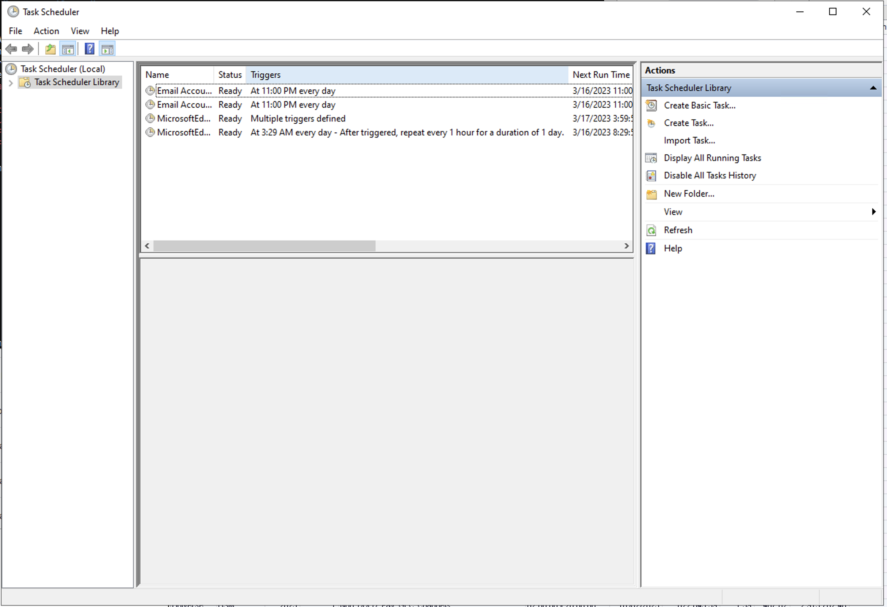
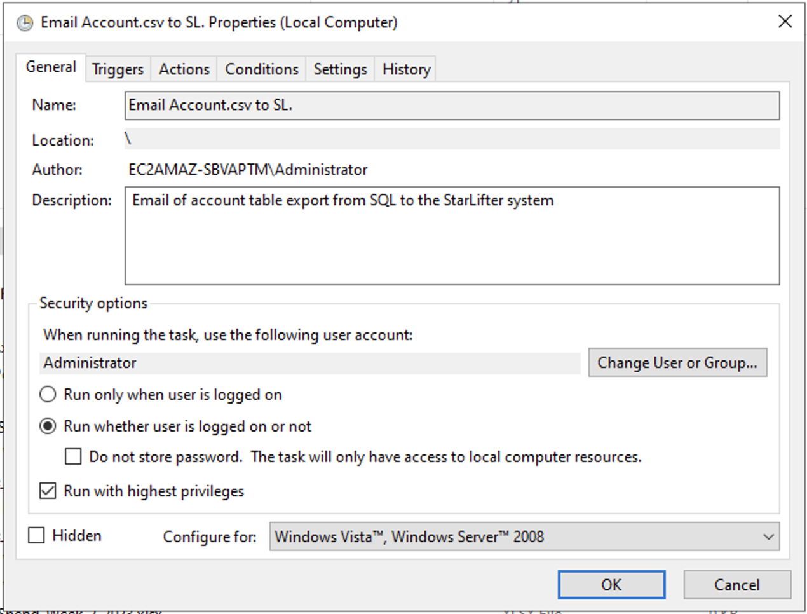
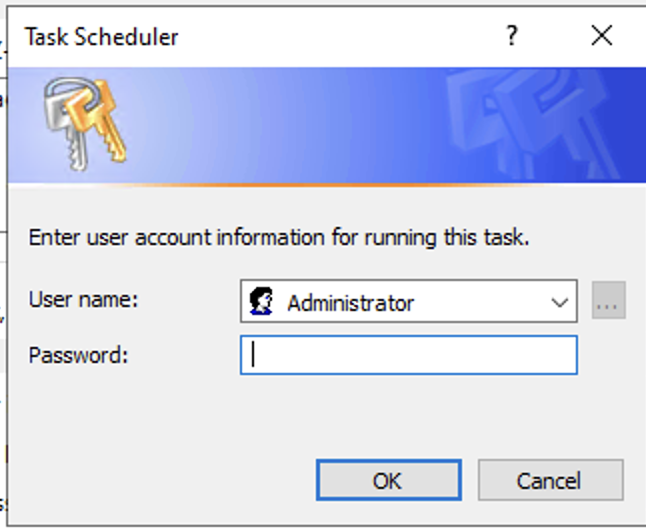

## Send a scheduled email from Windows via Powershell
You can use PowerShell to send an email with an attachment to a designated StarLifter email address.

### Create the PowerShell script

Open the Powershell environment by searching for Powershell in the Windows search and selecting Windows Powershell ISE.

</img>

Select File --> New from the taskbar menu to create a new Powershell document.

</img>

Copy/Paste the example Powershell script from the section below [Example](#example-powershell-command) and change the values in the brackets.

</img>

</img>

Select File --> Save As from the taskbar menu and name your new Powershell document.

</img>


### Create a Windows scheduled task to run the Powershell command
Open the Task Scheduler by searching for and selecting Task Scheduler in the Windows search.

</img>

Select Create Basic Task from the Actions menu in the righ-hand pane.

</img>

Add a name and description for the scheduled task.

Click Next.

</img>

Choose the frequency to run the task.

Click Next.

</img>

Set the date, time, and recurrence of the task.

Click Next.

</img>

Choose Start a program.

Click Next.

</img>

Enter the path of the Powershell application in the Program/Script box. Default - C:\Windows\System32\WindowsPowerShell\v1.0\powershell.exe

Enter the path of your newly created Powershell script in the Add Arguments box.

Click Next.

</img>

Select the checkbox, “Open the Properties dialog for this task when I click Finish”.

Click Finish.

</img>

In the properties dialog, under the General tab, check the “Run when user is logged on or not” and “Run with highest privileges” checkboxes.


</img>

You may have to enter your password to run the Task with elevated privileges.

</img>

### Example PowerShell command 
The following example uses a Gmail email address to send the email.
*Items in brackets [] need to be replaced.*

```
Send-MailMessage -From "[SEND EMAIL]" `
                 -To "[RECEPIENT EMAIL]" `
                 -Subject "[SUBJECT]" `
                 -Body "[BODY]" `
                 -Attachment "[PATH OF ATTACHEMENT]" `
                 -SmtpServer [SMTP SERVER] `
                 -Port 587 `
                 -UseSsl `
                 -Credential (New-Object `
                   -TypeName System.Management.Automation.PSCredential `
                   -ArgumentList "[EMAIL USERNAME]", `
                   (ConvertTo-SecureString `
                     -String "[EMAIL PASSWORD]" `
                     -AsPlainText -Force))

```
